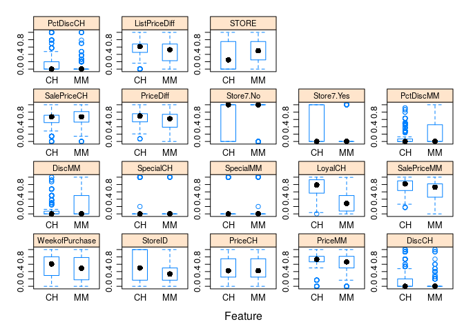
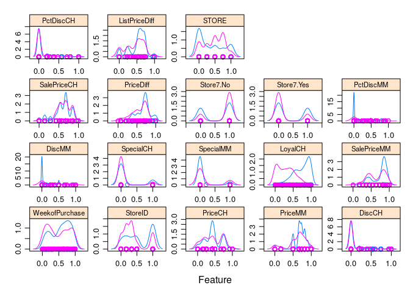
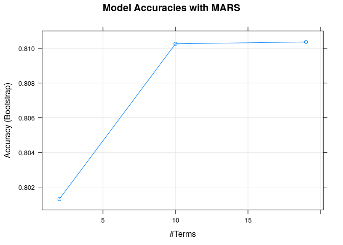
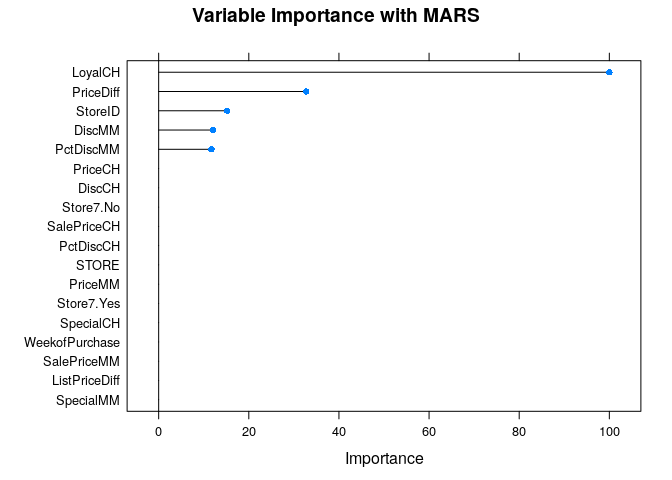
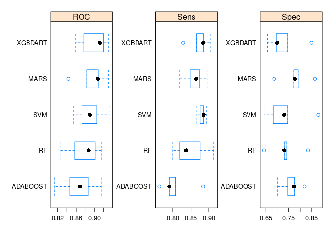

 Add summary desdcription of blog
 
<!--more-->


```r
library(tictoc)

tic.log(format = TRUE)
```

```
## list()
```

```r
tic("complete")
```


```r
tic("libraries")
# install.packages(c('caret', 'skimr', 'RANN', 'randomForest', 'fastAdaboost', 'gbm', 'xgboost', 'caretEnsemble', 'C50', 'earth'))

# Load the caret package
library(caret)
```

```
## Loading required package: lattice
```

```
## Loading required package: ggplot2
```

```r
# Import dataset
orange <- read.csv('https://raw.githubusercontent.com/selva86/datasets/master/orange_juice_withmissing.csv')

# Structure of the dataframe
str(orange)
```

```
## 'data.frame':	1070 obs. of  18 variables:
##  $ Purchase      : Factor w/ 2 levels "CH","MM": 1 1 1 2 1 1 1 1 1 1 ...
##  $ WeekofPurchase: int  237 239 245 227 228 230 232 234 235 238 ...
##  $ StoreID       : int  1 1 1 1 7 7 7 7 7 7 ...
##  $ PriceCH       : num  1.75 1.75 1.86 1.69 1.69 1.69 1.69 1.75 1.75 1.75 ...
##  $ PriceMM       : num  1.99 1.99 2.09 1.69 1.69 1.99 1.99 1.99 1.99 1.99 ...
##  $ DiscCH        : num  0 0 0.17 0 0 0 0 0 0 0 ...
##  $ DiscMM        : num  0 0.3 0 0 0 0 0.4 0.4 0.4 0.4 ...
##  $ SpecialCH     : int  0 0 0 0 0 0 1 1 0 0 ...
##  $ SpecialMM     : int  0 1 0 0 0 1 1 0 0 0 ...
##  $ LoyalCH       : num  0.5 0.6 0.68 0.4 0.957 ...
##  $ SalePriceMM   : num  1.99 1.69 2.09 1.69 1.69 1.99 1.59 1.59 1.59 1.59 ...
##  $ SalePriceCH   : num  1.75 1.75 1.69 1.69 1.69 1.69 1.69 1.75 1.75 1.75 ...
##  $ PriceDiff     : num  0.24 -0.06 0.4 0 0 0.3 -0.1 -0.16 -0.16 -0.16 ...
##  $ Store7        : Factor w/ 2 levels "No","Yes": 1 1 1 1 2 2 2 2 2 2 ...
##  $ PctDiscMM     : num  0 0.151 0 0 0 ...
##  $ PctDiscCH     : num  0 0 0.0914 0 0 ...
##  $ ListPriceDiff : num  0.24 0.24 0.23 0 0 0.3 0.3 0.24 0.24 0.24 ...
##  $ STORE         : int  1 1 1 1 0 0 0 0 0 0 ...
```

```r
# See top 6 rows and 10 columns
head(orange[, 1:10])
```

```
##   Purchase WeekofPurchase StoreID PriceCH PriceMM DiscCH DiscMM SpecialCH
## 1       CH            237       1    1.75    1.99   0.00    0.0         0
## 2       CH            239       1    1.75    1.99   0.00    0.3         0
## 3       CH            245       1    1.86    2.09   0.17    0.0         0
## 4       MM            227       1    1.69    1.69   0.00    0.0         0
## 5       CH            228       7    1.69    1.69   0.00    0.0         0
## 6       CH            230       7    1.69    1.99   0.00    0.0         0
##   SpecialMM  LoyalCH
## 1         0 0.500000
## 2         1 0.600000
## 3         0 0.680000
## 4         0 0.400000
## 5         0 0.956535
## 6         1 0.965228
```

```r
toc(log = TRUE, quiet = TRUE)
```
3. Data Preparation and Preprocessing
3.1. How to split the dataset into training and validation?


```r
# Create the training and test datasets
set.seed(100)

# Step 1: Get row numbers for the training data
trainRowNumbers <- createDataPartition(orange$Purchase, p=0.8, list=FALSE)

# Step 2: Create the training  dataset
trainData <- orange[trainRowNumbers,]

# Step 3: Create the test dataset
testData <- orange[-trainRowNumbers,]

# Store X and Y for later use.
x = trainData[, 2:18]
y = trainData$Purchase
```

createDataPartition() takes as input the Y variable in the source dataset and the percentage data that should go into training as the p argument. It returns the rownumbers that should form the training dataset.

Plus, you need to set list=F, to prevent returning the result as a list.


```r
library(skimr)
```

```
## 
## Attaching package: 'skimr'
```

```
## The following object is masked from 'package:stats':
## 
##     filter
```

```r
skimmed <- skim_to_wide(trainData)
skimmed[, c(1:5, 9:11, 13, 15:16)] 
```

```
## # A tibble: 18 x 11
##    type  variable missing complete n     mean  sd    p0    p50   p100 
##    <chr> <chr>    <chr>   <chr>    <chr> <chr> <chr> <chr> <chr> <chr>
##  1 fact… Purchase 0       857      857   <NA>  <NA>  <NA>  <NA>  <NA> 
##  2 fact… Store7   0       857      857   <NA>  <NA>  <NA>  <NA>  <NA> 
##  3 inte… Special… 2       855      857   "  0… " 0.… 0     0     1    
##  4 inte… Special… 4       853      857   "  0… " 0.… 0     0     1    
##  5 inte… STORE    2       855      857   "  1… " 1.… 0     2     4    
##  6 inte… StoreID  1       856      857   "  3… " 2.… 1     3     7    
##  7 inte… WeekofP… 0       857      857   254.… 15.59 227   257   278  
##  8 nume… DiscCH   2       855      857   0.054 "0.1… " 0 … "0  … "0.5…
##  9 nume… DiscMM   3       854      857   "0.1… "0.2… " 0 … "0  … "0.8…
## 10 nume… ListPri… 0       857      857   "0.2… "0.1… " 0 … 0.24  0.44 
## 11 nume… LoyalCH  5       852      857   "0.5… "0.3… " 1.… "0.6… "1  …
## 12 nume… PctDisc… 2       855      857   0.028 0.063 " 0 … "0  … 0.25 
## 13 nume… PctDisc… 2       855      857   0.058 0.099 " 0 … "0  … "0.4…
## 14 nume… PriceCH  1       856      857   "1.8… "0.1… " 1.… 1.86  2.09 
## 15 nume… PriceDi… 1       856      857   "0.1… "0.2… "-0.… 0.23  0.64 
## 16 nume… PriceMM  1       856      857   "2.0… "0.1… " 1.… 2.09  2.29 
## 17 nume… SalePri… 1       856      857   "1.8… "0.1… " 1.… 1.86  2.09 
## 18 nume… SalePri… 3       854      857   "1.9… "0.2… " 1.… 2.09  2.29 
## # … with 1 more variable: hist <chr>
```


3.3. How to impute missing values using preProcess()?


```r
# Create the knn imputation model on the training data
preProcess_missingdata_model <- preProcess(trainData, method='knnImpute')
preProcess_missingdata_model
```

```
## Created from 828 samples and 18 variables
## 
## Pre-processing:
##   - centered (16)
##   - ignored (2)
##   - 5 nearest neighbor imputation (16)
##   - scaled (16)
```


The above output shows the various preprocessing steps done in the process of knn imputation.

That is, it has centered (subtract by mean) 16 variables, ignored 2, used k=5 (considered 5 nearest neighbors) to predict the missing values and finally scaled (divide by standard deviation) 16 variables.

Let’s now use this model to predict the missing values in trainData.


```r
# Use the imputation model to predict the values of missing data points
library(RANN)  # required for knnInpute
trainData <- predict(preProcess_missingdata_model, newdata = trainData)
anyNA(trainData)
```

```
## [1] FALSE
```

3.4. How to create One-Hot Encoding (dummy variables)?
Let me first explain what is one-hot encoding and why it is required.

Suppose if you have a categorical column as one of the features, it needs to be converted to numeric in order for it to be used by the machine learning algorithms.

Just replacing the categories with a number may not be meaningful especially if there is no intrinsic ordering amongst the categories.

So what you can do instead is to convert the categorical variable with as many binary (1 or 0) variables as there are categories.

An important aspect you should be careful about here is, in real-world environments, you might get new values of categorical variables in the new scoring data. So, you should ensure the dummyVars model is built on the training data alone and that model is in turn used to create the dummy vars on the test data.

One Hot Encoding
ONE HOT ENCODING

In caret, one-hot-encodings can be created using dummyVars(). Just pass in all the features to dummyVars() as the training data and all the factor columns will automatically be converted to one-hot-encodings.


```r
# One-Hot Encoding
# Creating dummy variables is converting a categorical variable to as many binary variables as here are categories.
dummies_model <- dummyVars(Purchase ~ ., data=trainData)

# Create the dummy variables using predict. The Y variable (Purchase) will not be present in trainData_mat.
trainData_mat <- predict(dummies_model, newdata = trainData)
```

```
## Warning in model.frame.default(Terms, newdata, na.action = na.action, xlev
## = object$lvls): variable 'Purchase' is not a factor
```

```r
# # Convert to dataframe
trainData <- data.frame(trainData_mat)

# # See the structure of the new dataset
str(trainData)
```

```
## 'data.frame':	857 obs. of  18 variables:
##  $ WeekofPurchase: num  -1.1 -1.74 -1.68 -1.29 -1.04 ...
##  $ StoreID       : num  -1.29 -1.29 1.33 1.33 1.33 ...
##  $ PriceCH       : num  -1.14 -1.73 -1.73 -1.14 -1.14 ...
##  $ PriceMM       : num  -0.688 -2.898 -2.898 -0.688 -0.688 ...
##  $ DiscCH        : num  -0.452 -0.452 -0.452 -0.452 -0.452 ...
##  $ DiscMM        : num  -0.582 -0.582 -0.582 1.341 1.341 ...
##  $ SpecialCH     : num  -0.429 -0.429 -0.429 2.329 -0.429 ...
##  $ SpecialMM     : num  -0.42 -0.42 -0.42 -0.42 -0.42 ...
##  $ LoyalCH       : num  -0.205 -0.525 1.256 1.324 1.35 ...
##  $ SalePriceMM   : num  0.113 -1.101 -1.101 -1.506 -1.506 ...
##  $ SalePriceCH   : num  -0.431 -0.844 -0.844 -0.431 -0.431 ...
##  $ PriceDiff     : num  0.341 -0.563 -0.563 -1.165 -1.165 ...
##  $ Store7.No     : num  1 1 0 0 0 0 0 0 0 1 ...
##  $ Store7.Yes    : num  0 0 1 1 1 1 1 1 1 0 ...
##  $ PctDiscMM     : num  -0.588 -0.588 -0.588 1.447 1.447 ...
##  $ PctDiscCH     : num  -0.448 -0.448 -0.448 -0.448 -0.448 ...
##  $ ListPriceDiff : num  0.211 -1.988 -1.988 0.211 0.211 ...
##  $ STORE         : num  -0.457 -0.457 -1.15 -1.15 -1.15 ...
```

In above case, we had one categorical variable, Store7 with 2 categories. It was one-hot-encoded to produce two new columns – Store7.No and Store7.Yes.


3.5. How to preprocess to transform the data?
With the missing values handled and the factors one-hot-encoded, our training dataset is now ready to undergo variable transformations if required.

So what type of preprocessing are available in caret?

range: Normalize values so it ranges between 0 and 1
center: Subtract Mean
scale: Divide by standard deviation
BoxCox: Remove skewness leading to normality. Values must be > 0
YeoJohnson: Like BoxCox, but works for negative values.
expoTrans: Exponential transformation, works for negative values.
pca: Replace with principal components
ica: Replace with independent components
spatialSign: Project the data to a unit circle
For our problem, let’s convert all the numeric variables to range between 0 and 1, by setting method=range in preProcess().


```r
preProcess_range_model <- preProcess(trainData, method='range')
trainData <- predict(preProcess_range_model, newdata = trainData)

# Append the Y variable
trainData$Purchase <- y

apply(trainData[, 1:10], 2, FUN=function(x){c('min'=min(x), 'max'=max(x))})
```

```
##     WeekofPurchase StoreID PriceCH PriceMM DiscCH DiscMM SpecialCH
## min              0       0       0       0      0      0         0
## max              1       1       1       1      1      1         1
##     SpecialMM LoyalCH SalePriceMM
## min         0       0           0
## max         1       1           1
```


4. How to visualize the importance of variables using featurePlot()
Now that the preprocessing is complete, let’s visually examine how the predictors influence the Y (Purchase).

In this problem, the X variables are numeric whereas the Y is categorical.

So how to gauge if a given X is an important predictor of Y?

A simple common sense approach is, if you group the X variable by the categories of Y, a significant mean shift amongst the X’s groups is a strong indicator (if not the only indicator) that X will have a significant role to help predict Y.

It is possible to watch this shift visually using box plots and density plots.

In fact, caret’s featurePlot() function makes it so convenient.

Simply set the X and Y parameters and set plot='box'. You can additionally adjust the label font size (using strip) and the scales to be free as I have done in the below plot.


```r
featurePlot(x = trainData[, 1:18], 
            y = trainData$Purchase, 
            plot = "box",
            strip=strip.custom(par.strip.text=list(cex=.7)),
            scales = list(x = list(relation="free"), 
                          y = list(relation="free")))
```

<!-- -->
Let me quickly refresh how to interpret a boxplot.

Each subplot in the above figure has two boxplots (in blue) inside it, one each for each of the Y categories, CH and MM. The top of the box represents the 25th %ile and the bottom of the box represents the 75th %ile. The black dot inside the box is the mean.

The blue box represents the region where most of the regular data point lie.

The subplots also show many blue dots lying outside the top and bottom dashed lines called whiskers. These dots are formally considered as extreme values.

So, What did you observe in the above figure?

Consider for example, LoyalCHs subplot, which measures the loyalty score of the customer to the CH brand. The mean and the placement of the two boxes are glaringly different.

Just by seeing that, I am pretty sure, LoyalCH is going to be a significant predictor of Y.

What other predictors do you notice have significant mean differences?

Let’s do a similar exercise with density plots.

In this case, For a variable to be important, I would expect the density curves to be significantly different for the 2 classes, both in terms of the height (kurtosis) and placement (skewness).

Take a look at the density curves of the two categories for ‘LoyalCH’, ‘STORE’, ‘StoreID’, ‘WeekofPurchase’. Are they different?


```r
featurePlot(x = trainData[, 1:18], 
            y = trainData$Purchase, 
            plot = "density",
            strip=strip.custom(par.strip.text=list(cex=.7)),
            scales = list(x = list(relation="free"), 
                          y = list(relation="free")))
```

<!-- -->

Having visualised the relationships between X and Y, We can only say which variables are likely to be important to predict Y. It may not be wise to conclude which variables are NOT important.

Because sometimes, variables with uninteresting pattern can help explain certain aspects of Y that the visually important variables may not.

So to be safe, let’s not arrive at conclusions about excluding variables prematurely.

# 5. How to do feature selection using recursive feature elimination (rfe)?
Most machine learning algorithms are able to determine what features are important to predict the Y. But in some scenarios, you might be need to be careful to include only variables that may be significantly important and makes strong business sense.

This is quite common in banking, economics and financial institutions.

Or you might just be doing an exploratory analysis to determine important predictors and report it as a metric in your analytics dashboard.

Or if you are using a traditional algorithm like like linear or logistic regression, determining what variable to feed to the model is in the hands of the practitioner.

Given such requirements, you might need a rigorous way to determine the important variables first before feeding them to the ML algorithm.

A good choice of selecting the important features is the recursive feature elimination (RFE).

So how does recursive feature elimination work?

RFE works in 3 broad steps:

Step 1: Build a ML model on a training dataset and estimate the feature importances on the test dataset.

Step 2: Keeping priority to the most important variables, iterate through by building models of given sizes. Ranking of the predictors is recalculated in each iteration.

Step 3: The model performances are compared across different subset sizes to arrive at the optimal number and list of final predictors.

It can be implemented using the rfe() function and you have the flexibility to control what algorithm rfe uses and how it cross validates by defining the rfeControl().

```r
library(randomForest)
```

```
## randomForest 4.6-14
```

```
## Type rfNews() to see new features/changes/bug fixes.
```

```
## 
## Attaching package: 'randomForest'
```

```
## The following object is masked from 'package:ggplot2':
## 
##     margin
```

```r
set.seed(100)
options(warn=-1)

subsets <- c(1:5, 10, 15, 18)

ctrl <- rfeControl(functions = rfFuncs,
                   method = "repeatedcv",
                   repeats = 5,
                   verbose = FALSE)

lmProfile <- rfe(x=trainData[, 1:18], y=trainData$Purchase,
                 sizes = subsets,
                 rfeControl = ctrl)
lmProfile
```

```
## 
## Recursive feature selection
## 
## Outer resampling method: Cross-Validated (10 fold, repeated 5 times) 
## 
## Resampling performance over subset size:
## 
##  Variables Accuracy  Kappa AccuracySD KappaSD Selected
##          1   0.7440 0.4563    0.04010 0.08519         
##          2   0.8147 0.6074    0.03647 0.07789         
##          3   0.8205 0.6189    0.04137 0.08774        *
##          4   0.8035 0.5852    0.04663 0.09682         
##          5   0.8024 0.5818    0.04475 0.09458         
##         10   0.8038 0.5838    0.04380 0.09314         
##         15   0.8077 0.5896    0.04221 0.09025         
##         18   0.8054 0.5853    0.03991 0.08606         
## 
## The top 3 variables (out of 3):
##    LoyalCH, PriceDiff, StoreID
```


The top 3 variables (out of 3):
   LoyalCH, PriceDiff, StoreID
In the above code, we call the rfe() which implements the recursive feature elimination.

Apart from the x and y datasets, RFE also takes two important parameters.

sizes
rfeControl
The sizes determines what all model sizes (the number of most important features) the rfe should consider. In above case, it iterates models of size 1 to 5, 10, 15 and 18.

The rfeControl parameter on the other hand receives the output of the rfeControl() as values. If you look at the call to rfeControl() we set what type of algorithm and what cross validation method should be used.

In above case, the cross validation method is repeatedcv which implements k-Fold cross validation repeated 5 times, which is rigorous enough for our case.

Once rfe() is run, the output shows the accuracy and kappa (and their standard deviation) for the different model sizes we provided. The final selected model subset size is marked with a * in the rightmost Selected column.

From the above output, a model size of 3 with LoyalCH, PriceDiff and StoreID seems to achieve the optimal accuracy.

That means, out of 18 other features, a model with just 3 features outperformed many other larger model. Interesting isn’t it! Can you explain why?

However, it is not a mandate that only including these 3 variables will always give high accuracy over larger sized models.

Thats because, the rfe() we just implemented is particular to random forest based rfFuncs

Since ML algorithms have their own way of learning the relationship between the x and y, it is not wise to neglect the other predictors, especially when there is evidence that there is information contained in rest of the variables to explain the relationship between x and y.

Plus also, since the training dataset isn’t large enough, the other predictors may not have had the chance to show its worth.

In the next step, we will build the actual randomForest model on trainData.

6. Training and Tuning the model
6.1. How to train() the model and interpret the results?
Now comes the important stage where you actually build the machine learning model.

To know what models caret supports, run the following:


```r
# See available algorithms in caret
modelnames <- paste(names(getModelInfo()), collapse=',  ')
modelnames
```

```
## [1] "ada,  AdaBag,  AdaBoost.M1,  adaboost,  amdai,  ANFIS,  avNNet,  awnb,  awtan,  bag,  bagEarth,  bagEarthGCV,  bagFDA,  bagFDAGCV,  bam,  bartMachine,  bayesglm,  binda,  blackboost,  blasso,  blassoAveraged,  bridge,  brnn,  BstLm,  bstSm,  bstTree,  C5.0,  C5.0Cost,  C5.0Rules,  C5.0Tree,  cforest,  chaid,  CSimca,  ctree,  ctree2,  cubist,  dda,  deepboost,  DENFIS,  dnn,  dwdLinear,  dwdPoly,  dwdRadial,  earth,  elm,  enet,  evtree,  extraTrees,  fda,  FH.GBML,  FIR.DM,  foba,  FRBCS.CHI,  FRBCS.W,  FS.HGD,  gam,  gamboost,  gamLoess,  gamSpline,  gaussprLinear,  gaussprPoly,  gaussprRadial,  gbm_h2o,  gbm,  gcvEarth,  GFS.FR.MOGUL,  GFS.LT.RS,  GFS.THRIFT,  glm.nb,  glm,  glmboost,  glmnet_h2o,  glmnet,  glmStepAIC,  gpls,  hda,  hdda,  hdrda,  HYFIS,  icr,  J48,  JRip,  kernelpls,  kknn,  knn,  krlsPoly,  krlsRadial,  lars,  lars2,  lasso,  lda,  lda2,  leapBackward,  leapForward,  leapSeq,  Linda,  lm,  lmStepAIC,  LMT,  loclda,  logicBag,  LogitBoost,  logreg,  lssvmLinear,  lssvmPoly,  lssvmRadial,  lvq,  M5,  M5Rules,  manb,  mda,  Mlda,  mlp,  mlpKerasDecay,  mlpKerasDecayCost,  mlpKerasDropout,  mlpKerasDropoutCost,  mlpML,  mlpSGD,  mlpWeightDecay,  mlpWeightDecayML,  monmlp,  msaenet,  multinom,  mxnet,  mxnetAdam,  naive_bayes,  nb,  nbDiscrete,  nbSearch,  neuralnet,  nnet,  nnls,  nodeHarvest,  null,  OneR,  ordinalNet,  ordinalRF,  ORFlog,  ORFpls,  ORFridge,  ORFsvm,  ownn,  pam,  parRF,  PART,  partDSA,  pcaNNet,  pcr,  pda,  pda2,  penalized,  PenalizedLDA,  plr,  pls,  plsRglm,  polr,  ppr,  PRIM,  protoclass,  qda,  QdaCov,  qrf,  qrnn,  randomGLM,  ranger,  rbf,  rbfDDA,  Rborist,  rda,  regLogistic,  relaxo,  rf,  rFerns,  RFlda,  rfRules,  ridge,  rlda,  rlm,  rmda,  rocc,  rotationForest,  rotationForestCp,  rpart,  rpart1SE,  rpart2,  rpartCost,  rpartScore,  rqlasso,  rqnc,  RRF,  RRFglobal,  rrlda,  RSimca,  rvmLinear,  rvmPoly,  rvmRadial,  SBC,  sda,  sdwd,  simpls,  SLAVE,  slda,  smda,  snn,  sparseLDA,  spikeslab,  spls,  stepLDA,  stepQDA,  superpc,  svmBoundrangeString,  svmExpoString,  svmLinear,  svmLinear2,  svmLinear3,  svmLinearWeights,  svmLinearWeights2,  svmPoly,  svmRadial,  svmRadialCost,  svmRadialSigma,  svmRadialWeights,  svmSpectrumString,  tan,  tanSearch,  treebag,  vbmpRadial,  vglmAdjCat,  vglmContRatio,  vglmCumulative,  widekernelpls,  WM,  wsrf,  xgbDART,  xgbLinear,  xgbTree,  xyf"
```


Each of those is a machine learning algorithm caret supports.

Yes, it’s a huge list!

And if you want to know more details like the hyperparameters and if it can be used of regression or classification problem, then do a modelLookup(algo).

Once you have chosen an algorithm, building the model is fairly easy using the train() function.

Let’s train a Multivariate Adaptive Regression Splines (MARS) model by setting the method='earth'.

The MARS algorithm was named as ‘earth’ in R because of a possible trademark conflict with Salford Systems. May be a rumor. Or not.

```r
modelLookup('earth')
```

```
##   model parameter          label forReg forClass probModel
## 1 earth    nprune         #Terms   TRUE     TRUE      TRUE
## 2 earth    degree Product Degree   TRUE     TRUE      TRUE
```


```r
# Set the seed for reproducibility
set.seed(100)

# Train the model using randomForest and predict on the training data itself.
model_mars = train(Purchase ~ ., data=trainData, method='earth')
```

```
## Loading required package: earth
```

```
## Loading required package: Formula
```

```
## Loading required package: plotmo
```

```
## Loading required package: plotrix
```

```
## Loading required package: TeachingDemos
```

```r
fitted <- predict(model_mars)
```


But you may ask how is using train() different from using the algorithm’s function directly?

The difference is, besides building the model train() does multiple other things like:

Cross validating the model
Tune the hyper parameters for optimal model performance
Choose the optimal model based on a given evaluation metric
Preprocess the predictors (what we did so far using preProcess())
The train function also accepts the arguments used by the algorithm specified in the method argument.

Now let’s see what the train() has generated.

```r
model_mars
```

```
## Multivariate Adaptive Regression Spline 
## 
## 857 samples
##  18 predictor
##   2 classes: 'CH', 'MM' 
## 
## No pre-processing
## Resampling: Bootstrapped (25 reps) 
## Summary of sample sizes: 857, 857, 857, 857, 857, 857, ... 
## Resampling results across tuning parameters:
## 
##   nprune  Accuracy   Kappa    
##    2      0.8013184  0.5746285
##   10      0.8102610  0.5987447
##   19      0.8103685  0.5986923
## 
## Tuning parameter 'degree' was held constant at a value of 1
## Accuracy was used to select the optimal model using the largest value.
## The final values used for the model were nprune = 19 and degree = 1.
```


Tuning parameter 'degree' was held constant at a value of 1
Accuracy was used to select the optimal model using the largest value.
The final values used for the model were nprune = 19 and degree = 1.
You can see what is the Accuracy and Kappa for various combinations of the hyper parameters – interaction.depth and n.trees. And it says ‘Resampling: Bootstrapped (25 reps)’ with a summary of sample sizes.

Looks like train() has already done a basic cross validation and hyper parameter tuning. And that is the default behaviour.

The chosen model and its parameters is reported in the last 2 lines of the output.

When we used model_mars to predict the Y, this final model was automatically used by predict() to compute the predictions.

Plotting the model shows how the various iterations of hyperparameter search performed.

```r
plot(model_mars, main="Model Accuracies with MARS")
```

<!-- -->


## 6.2 How to compute variable importance?
Excellent, since MARS supports computing variable importances, let’s extract the variable importances using varImp() to understand which variables came out to be useful.

```r
varimp_mars <- varImp(model_mars)
plot(varimp_mars, main="Variable Importance with MARS")
```

<!-- -->


As suspected, LoyalCH was the most used variable, followed by PriceDiff and StoreID.

## 6.3. Prepare the test dataset and predict
A default MARS model has been selected.

Now in order to use the model to predict on new data, the data has to be preprocessed and transformed just the way we did on the training data.

Thanks to caret, all the information required for pre-processing is stored in the respective preProcess model and dummyVar model.

If you recall, we did the pre-processing in the following sequence:

Missing Value imputation –> One-Hot Encoding –> Range Normalization

You need to pass the testData through these models in the same sequence:

preProcess_missingdata_model –> dummies_model –> preProcess_range_model

```r
# Step 1: Impute missing values 
testData2 <- predict(preProcess_missingdata_model, testData)  

# Step 2: Create one-hot encodings (dummy variables)
testData3 <- predict(dummies_model, testData2)

# Step 3: Transform the features to range between 0 and 1
testData4 <- predict(preProcess_range_model, testData3)

# View
head(testData4[, 1:10])
```

```
##    WeekofPurchase StoreID PriceCH   PriceMM DiscCH DiscMM SpecialCH
## 2      0.23529412       0   0.150 0.5000000   0.00  0.375         0
## 3      0.35294118       0   0.425 0.6666667   0.34  0.000         0
## 6      0.05882353       1   0.000 0.5000000   0.00  0.000         0
## 7      0.09803922       1   0.000 0.5000000   0.00  0.500         1
## 9      0.15686275       1   0.150 0.5000000   0.00  0.500         0
## 13     0.96078431       1   0.750 0.7333333   0.00  0.675         0
##    SpecialMM   LoyalCH SalePriceMM
## 2          1 0.6000352   0.4545455
## 3          0 0.6800414   0.8181818
## 6          1 0.9652913   0.7272727
## 7          1 0.9722459   0.3636364
## 9          0 0.9822616   0.3636364
## 13         1 0.9927734   0.3636364
```


## 6.4. Predict on testData
The test dataset is prepared. Let’s predict the Y.

```r
# Predict on testData
predicted <- predict(model_mars, testData4)
head(predicted)
```

```
## [1] CH CH CH CH CH MM
## Levels: CH MM
```


## 6.5. Confusion Matrix
The confusion matrix is a tabular representation to compare the predictions (data) vs the actuals (reference). By setting mode='everything' pretty much most classification evaluation metrics are computed.

```r
# Compute the confusion matrix
confusionMatrix(reference = testData$Purchase, data = predicted, mode='everything', positive='MM')
```

```
## Confusion Matrix and Statistics
## 
##           Reference
## Prediction  CH  MM
##         CH 113  21
##         MM  17  62
##                                           
##                Accuracy : 0.8216          
##                  95% CI : (0.7635, 0.8705)
##     No Information Rate : 0.6103          
##     P-Value [Acc > NIR] : 2.139e-11       
##                                           
##                   Kappa : 0.6216          
##  Mcnemar's Test P-Value : 0.6265          
##                                           
##             Sensitivity : 0.7470          
##             Specificity : 0.8692          
##          Pos Pred Value : 0.7848          
##          Neg Pred Value : 0.8433          
##               Precision : 0.7848          
##                  Recall : 0.7470          
##                      F1 : 0.7654          
##              Prevalence : 0.3897          
##          Detection Rate : 0.2911          
##    Detection Prevalence : 0.3709          
##       Balanced Accuracy : 0.8081          
##                                           
##        'Positive' Class : MM              
## 
```


   
You have an overall accuracy of 80.28%.

# 7. How to do hyperparameter tuning to optimize the model for better performance?
There are two main ways to do hyper parameter tuning using the train():

Set the tuneLength
Define and set the tuneGrid
tuneLength corresponds to the number of unique values for the tuning parameters caret will consider while forming the hyper parameter combinations.

Caret will automatically determine the values each parameter should take.

Alternately, if you want to explicitly control what values should be considered for each parameter, then, you can define the tuneGrid and pass it to train().

Let’s see an example of both these approaches but first let’s setup the trainControl().

# 7.1. Setting up the trainControl()

The train() function takes a trControl argument that accepts the output of trainControl().

Inside trainControl() you can control how the train() will:

Cross validation method to use.
How the results should be summarised using a summary function
Cross validation method can be one amongst:

‘boot’: Bootstrap sampling
‘boot632’: Bootstrap sampling with 63.2% bias correction applied
‘optimism_boot’: The optimism bootstrap estimator
‘boot_all’: All boot methods.
‘cv’: k-Fold cross validation
‘repeatedcv’: Repeated k-Fold cross validation
‘oob’: Out of Bag cross validation
‘LOOCV’: Leave one out cross validation
‘LGOCV’: Leave group out cross validation
The summaryFunction can be twoClassSummary if Y is binary class or multiClassSummary if the Y has more than 2 categories.

By settiung the classProbs=T the probability scores are generated instead of directly predicting the class based on a predetermined cutoff of 0.5.

```r
# Define the training control
fitControl <- trainControl(
    method = 'cv',                   # k-fold cross validation
    number = 5,                      # number of folds
    savePredictions = 'final',       # saves predictions for optimal tuning parameter
    classProbs = T,                  # should class probabilities be returned
    summaryFunction=twoClassSummary  # results summary function
) 
```


##7.2 Hyper Parameter Tuning using tuneLength
Let’s take the train() function we used before, plus, additionally set the tuneLength, trControl and metric.

```r
# Step 1: Tune hyper parameters by setting tuneLength
set.seed(100)
model_mars2 = train(Purchase ~ ., data=trainData, method='earth', tuneLength = 5, metric='ROC', trControl = fitControl)
model_mars2
```

```
## Multivariate Adaptive Regression Spline 
## 
## 857 samples
##  18 predictor
##   2 classes: 'CH', 'MM' 
## 
## No pre-processing
## Resampling: Cross-Validated (5 fold) 
## Summary of sample sizes: 685, 685, 687, 686, 685 
## Resampling results across tuning parameters:
## 
##   nprune  ROC        Sens       Spec     
##    2      0.8745398  0.8700916  0.7006784
##    6      0.8912361  0.8719414  0.7334238
##   10      0.8879988  0.8623626  0.7423790
##   14      0.8879988  0.8623626  0.7423790
##   19      0.8879846  0.8661722  0.7483492
## 
## Tuning parameter 'degree' was held constant at a value of 1
## ROC was used to select the optimal model using the largest value.
## The final values used for the model were nprune = 6 and degree = 1.
```

```r
# Step 2: Predict on testData and Compute the confusion matrix
predicted2 <- predict(model_mars2, testData4)
confusionMatrix(reference = testData$Purchase, data = predicted2, mode='everything', positive='MM')
```

```
## Confusion Matrix and Statistics
## 
##           Reference
## Prediction  CH  MM
##         CH 116  20
##         MM  14  63
##                                           
##                Accuracy : 0.8404          
##                  95% CI : (0.7841, 0.8869)
##     No Information Rate : 0.6103          
##     P-Value [Acc > NIR] : 2.164e-13       
##                                           
##                   Kappa : 0.66            
##  Mcnemar's Test P-Value : 0.3912          
##                                           
##             Sensitivity : 0.7590          
##             Specificity : 0.8923          
##          Pos Pred Value : 0.8182          
##          Neg Pred Value : 0.8529          
##               Precision : 0.8182          
##                  Recall : 0.7590          
##                      F1 : 0.7875          
##              Prevalence : 0.3897          
##          Detection Rate : 0.2958          
##    Detection Prevalence : 0.3615          
##       Balanced Accuracy : 0.8257          
##                                           
##        'Positive' Class : MM              
## 
```


## 7.3. Hyper Parameter Tuning using tuneGrid
Alternately, you can set the tuneGrid instead of tuneLength.

```r
# Step 1: Define the tuneGrid
marsGrid <-  expand.grid(nprune = c(2, 4, 6, 8, 10), 
                        degree = c(1, 2, 3))

# Step 2: Tune hyper parameters by setting tuneGrid
set.seed(100)
model_mars3 = train(Purchase ~ ., data=trainData, method='earth', metric='ROC', tuneGrid = marsGrid, trControl = fitControl)
model_mars3
```

```
## Multivariate Adaptive Regression Spline 
## 
## 857 samples
##  18 predictor
##   2 classes: 'CH', 'MM' 
## 
## No pre-processing
## Resampling: Cross-Validated (5 fold) 
## Summary of sample sizes: 685, 685, 687, 686, 685 
## Resampling results across tuning parameters:
## 
##   degree  nprune  ROC        Sens       Spec     
##   1        2      0.8745398  0.8700916  0.7006784
##   1        4      0.8924657  0.8662454  0.7394844
##   1        6      0.8912361  0.8719414  0.7334238
##   1        8      0.8886974  0.8661722  0.7334238
##   1       10      0.8879988  0.8623626  0.7423790
##   2        2      0.8745398  0.8700916  0.7006784
##   2        4      0.8925044  0.8758425  0.7395296
##   2        6      0.8918962  0.8681868  0.7545002
##   2        8      0.8911809  0.8624359  0.7634102
##   2       10      0.8947444  0.8604579  0.7784261
##   3        2      0.8582783  0.8777106  0.6618725
##   3        4      0.8919687  0.8681502  0.7514699
##   3        6      0.8889365  0.8509341  0.7665310
##   3        8      0.8802930  0.8432784  0.7396653
##   3       10      0.8790021  0.8452015  0.7486205
## 
## ROC was used to select the optimal model using the largest value.
## The final values used for the model were nprune = 10 and degree = 2.
```

```r
# Step 3: Predict on testData and Compute the confusion matrix
predicted3 <- predict(model_mars3, testData4)
confusionMatrix(reference = testData$Purchase, data = predicted3, mode='everything', positive='MM')
```

```
## Confusion Matrix and Statistics
## 
##           Reference
## Prediction  CH  MM
##         CH 114  18
##         MM  16  65
##                                           
##                Accuracy : 0.8404          
##                  95% CI : (0.7841, 0.8869)
##     No Information Rate : 0.6103          
##     P-Value [Acc > NIR] : 2.164e-13       
##                                           
##                   Kappa : 0.6629          
##  Mcnemar's Test P-Value : 0.8638          
##                                           
##             Sensitivity : 0.7831          
##             Specificity : 0.8769          
##          Pos Pred Value : 0.8025          
##          Neg Pred Value : 0.8636          
##               Precision : 0.8025          
##                  Recall : 0.7831          
##                      F1 : 0.7927          
##              Prevalence : 0.3897          
##          Detection Rate : 0.3052          
##    Detection Prevalence : 0.3803          
##       Balanced Accuracy : 0.8300          
##                                           
##        'Positive' Class : MM              
## 
```


# 8. How to evaluate performance of multiple machine learning algorithms?
Caret provides the resamples() function where you can provide multiple machine learning models and collectively evaluate them.

Let’s first train some more algorithms.

##8.1. Training Adaboost

```r
set.seed(100)

# Train the model using adaboost
model_adaboost = train(Purchase ~ ., data=trainData, method='adaboost', tuneLength=2, trControl = fitControl)
```


##8.2. Training Random Forest


```r
set.seed(100)

# Train the model using rf
model_rf = train(Purchase ~ ., data=trainData, method='rf', tuneLength=5, trControl = fitControl)
```


8.3. Training xgBoost Dart

```r
set.seed(100)

# Train the model using MARS
model_xgbDART = train(Purchase ~ ., data=trainData, method='xgbDART', tuneLength=5, trControl = fitControl, verbose=F)
```


8.4. Training SVM

```r
set.seed(100)

# Train the model using MARS
model_svmRadial = train(Purchase ~ ., data=trainData, method='svmRadial', tuneLength=15, trControl = fitControl)
```


##8.5. Run resamples() to compare the models

```r
# Compare model performances using resample()
models_compare <- resamples(list(ADABOOST=model_adaboost, RF=model_rf, XGBDART=model_xgbDART, MARS=model_mars3, SVM=model_svmRadial))

# Summary of the models performances
summary(models_compare)
```

```
## 
## Call:
## summary.resamples(object = models_compare)
## 
## Models: ADABOOST, RF, XGBDART, MARS, SVM 
## Number of resamples: 5 
## 
## ROC 
##               Min.   1st Qu.    Median      Mean   3rd Qu.      Max. NA's
## ADABOOST 0.8126510 0.8462687 0.8682549 0.8657598 0.8868515 0.9147727    0
## RF       0.8253021 0.8568586 0.8877727 0.8775297 0.9017768 0.9159382    0
## XGBDART  0.8589197 0.8775409 0.9114524 0.8995839 0.9198718 0.9301350    0
## MARS     0.8433547 0.8839375 0.9073622 0.8947444 0.9084353 0.9306326    0
## SVM      0.8537313 0.8728500 0.8903559 0.8907736 0.9053030 0.9316276    0
## 
## Sens 
##               Min.   1st Qu.    Median      Mean   3rd Qu.      Max. NA's
## ADABOOST 0.7619048 0.7904762 0.7904762 0.8070330 0.8076923 0.8846154    0
## RF       0.8000000 0.8190476 0.8365385 0.8490476 0.8761905 0.9134615    0
## XGBDART  0.8285714 0.8666667 0.8846154 0.8738828 0.8857143 0.9038462    0
## MARS     0.8190476 0.8476190 0.8653846 0.8604579 0.8750000 0.8952381    0
## SVM      0.8653846 0.8761905 0.8857143 0.8814469 0.8857143 0.8942308    0
## 
## Spec 
##               Min.   1st Qu.    Median      Mean   3rd Qu.      Max. NA's
## ADABOOST 0.7014925 0.7462687 0.7727273 0.7635007 0.7761194 0.8208955    0
## RF       0.6417910 0.7313433 0.7313433 0.7365445 0.7424242 0.8358209    0
## XGBDART  0.6567164 0.6969697 0.7014925 0.7304387 0.7462687 0.8507463    0
## MARS     0.6865672 0.7727273 0.7761194 0.7784261 0.7910448 0.8656716    0
## SVM      0.6417910 0.6818182 0.7313433 0.7363636 0.7462687 0.8805970    0
```


Let’s plot the resamples summary output.


```r
# Draw box plots to compare models
scales <- list(x=list(relation="free"), y=list(relation="free"))
bwplot(models_compare, scales=scales)
```

<!-- -->


In the above output you can see clearly how the algorithms performed in terms of ROC, Specificity and Sensitivity and how consistent has it been.

The xgbDART model appears to be the be best performing model overall because of the high ROC. But if you need a model that predicts the positives better, you might want to consider MARS, given its high sensitivity.

Either way, you can now make an informed decision on which model to pick.

#9. Ensembling the predictions
##9.1. How to ensemble predictions from multiple models using caretEnsemble?
So we have predictions from multiple individual models. To do this we had to run the train() function once for each model, store the models and pass it to the res

The caretEnsemble package lets you do just that.

All you have to do is put the names of all the algorithms you want to run in a vector and pass it to caretEnsemble::caretList() instead of caret::train().

```r
library(caretEnsemble)
```

```
## 
## Attaching package: 'caretEnsemble'
```

```
## The following object is masked from 'package:ggplot2':
## 
##     autoplot
```

```r
# Stacking Algorithms - Run multiple algos in one call.
trainControl <- trainControl(method="repeatedcv", 
                             number=10, 
                             repeats=3,
                             savePredictions=TRUE, 
                             classProbs=TRUE)

algorithmList <- c('rf', 'adaboost', 'earth', 'xgbDART', 'svmRadial')

set.seed(100)
models <- caretList(Purchase ~ ., data=trainData, trControl=trainControl, methodList=algorithmList) 
results <- resamples(models)
```


Plot the resamples output to compare the models.


Excellent! It is possible for further tune the model within caretList in a customised way.

##9.2. How to combine the predictions of multiple models to form a final prediction
That one function simplified a whole lot of work in one line of code.

Here is another thought: Is it possible to combine these predicted values from multiple models somehow and make a new ensemble that predicts better?

Turns out this can be done too, using the caretStack(). You just need to make sure you don’t use the same trainControl you used to build the models.

```r
# Create the trainControl
set.seed(101)
stackControl <- trainControl(method="repeatedcv", 
                             number=10, 
                             repeats=3,
                             savePredictions=TRUE, 
                             classProbs=TRUE)

# Ensemble the predictions of `models` to form a new combined prediction based on glm
stack.glm <- caretStack(models, method="glm", metric="Accuracy", trControl=stackControl)
print(stack.glm)
```

```
## A glm ensemble of 2 base models: rf, adaboost, earth, xgbDART, svmRadial
## 
## Ensemble results:
## Generalized Linear Model 
## 
## 2571 samples
##    5 predictor
##    2 classes: 'CH', 'MM' 
## 
## No pre-processing
## Resampling: Cross-Validated (10 fold, repeated 3 times) 
## Summary of sample sizes: 2314, 2314, 2314, 2314, 2313, 2313, ... 
## Resampling results:
## 
##   Accuracy   Kappa    
##   0.8331519  0.6444917
```


A point to consider: The ensembles tend to perform better if the predictions are less correlated with each other.

So you may want to try passing different types of models, both high and low performing rather than just stick to passing high accuracy models to the caretStack.

```r
print(stack.glm)
```

```
## A glm ensemble of 2 base models: rf, adaboost, earth, xgbDART, svmRadial
## 
## Ensemble results:
## Generalized Linear Model 
## 
## 2571 samples
##    5 predictor
##    2 classes: 'CH', 'MM' 
## 
## No pre-processing
## Resampling: Cross-Validated (10 fold, repeated 3 times) 
## Summary of sample sizes: 2314, 2314, 2314, 2314, 2313, 2313, ... 
## Resampling results:
## 
##   Accuracy   Kappa    
##   0.8331519  0.6444917
```


```r
# Predict on testData
stack_predicteds <- predict(stack.glm, newdata=testData4)
head(stack_predicteds)
```

```
## [1] CH CH CH CH CH CH
## Levels: CH MM
```


# 10. Conclusion
The purpose of this post was to cover the core pieces of the caret package and how you can effectively use it to build machine learning models.

This information should serve as a reference and also as a template you can use to build a standardised machine learning workflow, so you can develop it further from there.


```r
bot$sendMessage('RMarkdown ready')
```


```r
sessionInfo()
```

```
## R version 3.4.4 (2018-03-15)
## Platform: x86_64-pc-linux-gnu (64-bit)
## Running under: Ubuntu 18.04.2 LTS
## 
## Matrix products: default
## BLAS: /usr/lib/x86_64-linux-gnu/blas/libblas.so.3.7.1
## LAPACK: /usr/lib/x86_64-linux-gnu/lapack/liblapack.so.3.7.1
## 
## locale:
##  [1] LC_CTYPE=C.UTF-8       LC_NUMERIC=C           LC_TIME=C.UTF-8       
##  [4] LC_COLLATE=C.UTF-8     LC_MONETARY=C.UTF-8    LC_MESSAGES=C.UTF-8   
##  [7] LC_PAPER=C.UTF-8       LC_NAME=C              LC_ADDRESS=C          
## [10] LC_TELEPHONE=C         LC_MEASUREMENT=C.UTF-8 LC_IDENTIFICATION=C   
## 
## attached base packages:
## [1] stats     graphics  grDevices utils     datasets  methods   base     
## 
## other attached packages:
##  [1] caretEnsemble_2.0.0 earth_5.1.1         plotmo_3.5.4       
##  [4] TeachingDemos_2.10  plotrix_3.7-4       Formula_1.2-3      
##  [7] randomForest_4.6-14 RANN_2.6.1          skimr_1.0.5        
## [10] caret_6.0-81        ggplot2_3.1.0       lattice_0.20-35    
## [13] tictoc_1.0         
## 
## loaded via a namespace (and not attached):
##  [1] Rcpp_1.0.1         lubridate_1.7.4    class_7.3-14      
##  [4] assertthat_0.2.1   digest_0.6.18      ipred_0.9-8       
##  [7] foreach_1.4.4      R6_2.4.0           plyr_1.8.4        
## [10] fastAdaboost_1.0.0 stats4_3.4.4       evaluate_0.13     
## [13] e1071_1.7-1        pillar_1.3.1       rlang_0.3.3       
## [16] lazyeval_0.2.1     rstudioapi_0.10    data.table_1.12.0 
## [19] kernlab_0.9-27     rpart_4.1-13       Matrix_1.2-12     
## [22] rmarkdown_1.12     splines_3.4.4      gower_0.2.0       
## [25] stringr_1.4.0      munsell_0.5.0      compiler_3.4.4    
## [28] xfun_0.6           pkgconfig_2.0.2    htmltools_0.3.6   
## [31] nnet_7.3-12        tidyselect_0.2.5   gridExtra_2.3     
## [34] tibble_2.1.1       prodlim_2018.04.18 codetools_0.2-15  
## [37] crayon_1.3.4       dplyr_0.8.0.1      withr_2.1.2       
## [40] MASS_7.3-49        recipes_0.1.5      ModelMetrics_1.2.2
## [43] grid_3.4.4         nlme_3.1-131       gtable_0.2.0      
## [46] magrittr_1.5       scales_1.0.0       pbapply_1.4-0     
## [49] stringi_1.4.3      reshape2_1.4.3     timeDate_3043.102 
## [52] generics_0.0.2     xgboost_0.82.1     lava_1.6.5        
## [55] iterators_1.0.10   tools_3.4.4        glue_1.3.1        
## [58] purrr_0.3.2        parallel_3.4.4     survival_2.41-3   
## [61] yaml_2.2.0         colorspace_1.4-1   knitr_1.22
```

