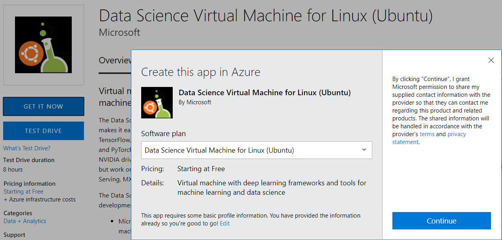

---
output:
  html_document:
    highlight: tango
    toc: yes
    toc_float: no
  pdf_document:
    number_sections: yes
geometry: margin = 1.2in
fontsize: 10pt
always_allow_html: yes
---

```{r setup, include=FALSE}
knitr::opts_chunk$set(echo = TRUE,error=TRUE)


knitr::knit_hooks$set(
   error = function(x, options) {
     paste('\n\n<div class="alert alert-danger">',
           gsub('##', '\n', gsub('^##\ Error', '**Error**', x)),
           '</div>', sep = '\n')
   },
   warning = function(x, options) {
     paste('\n\n<div class="alert alert-warning">',
           gsub('##', '\n', gsub('^##\ Warning:', '**Warning**', x)),
           '</div>', sep = '\n')
   },
   message = function(x, options) {
     paste('\n\n<div class="alert alert-info">',
           gsub('##', '\n', x),
           '</div>', sep = '\n')
   }
)
```
<style type="text/css">

body, td {
   font-size: 20px;
}
code.r{
  font-size: 20px;
}
pre {
  font-size: 20px
}
</style>


I recently got an SurfacePro 4 with which I’m very happy, but it did make me realise that if a Tablet was to replace my normal desktop as my primary workstation, my RStudio Server setup would need to be more cloud native than was available up until now.

A how-to on making RStudio Server run on a Laptop/Tablet that automatically backs up data and configuration settings to Azure Storage.

Broken promises of the cloud?
Whilst there are lots of other solutions around for hosting RStudio Server in the cloud, including some of my own, I don’t believe they are a serious replacement for a desktop station running RStudio.

To date I’ve treated RStudio Server as a temporary UI whilst setting up scheduled scripts and so forth, and for running workshops for students with pre-installed packages. Yes, the convenience of running RStudio in a browser and being able to launch different configurations is great, but it wasn’t a total desktop replacement for the following reasons:

More expensive - running RStudio Server permanently in the cloud can be done for as little as 5 dollars a month, but for that you get a machine about as powerful as a Raspberry Pi. For a proper workstation with decent RAM etc, you are looking at more like 30 dollars a month, which if you’re running for 2 years is around $700 that you could have spent on a laptop that can do more things.
More risky - keeping the only copy of your data on a cloud server is not a good idea, as I learnt to my cost when a VM’s hard disk filled up. Unable to log in, a convoluted panic to increase the disk size occurred. A physical laptop is a lot easier to troubleshoot if something goes awry.
Not flexible enough - if you run out of RAM or want things to compute quicker, you are going to need to transfer your data and boot up another VM with stronger specs.
But isn’t the allure of cheaper, safer, more flexible computing the reason we are using the cloud in the first place?

# Going Cloud Native
I believe the reason for the dichotomy between expectation and reality is due to not being “Cloud Native” enough, something I realised whilst attending this year’s Google NEXT event. There they described three phases of business cloud evolution:

Lift and Shift - moving your existing infrastructure into equivalent cloud versions
Separation of compute and data - abstracting out the computing away from the data the computing is running on. Essentially letting the cloud take on the roles of your hard disk vs your CPU.
Platform-as-a-service (PaaS) - abstracting away the servers the computing and data are running on, so as to run on purely managed services such as BigQuery, Kubernetes and AppEngine
From the above, existing RStudio Server solutions are in the Lift and Shift vein, whilst what we may imagine to be The Cloud are in the more evolved options.

#Preparation

## Install Azure CLI 2.0 on Host

In Terminal
>azure login

## Use this helper function

```{r}
library(jsonlite)

azR<-function(code){
a<-fromJSON(system(code,intern = TRUE))
return(a)
}

```

## Use of R packages


Create Authenification 

Follow
http://htmlpreview.github.io/?https://github.com/Microsoft/AzureSMR/blob/master/inst/doc/Authentication.html

Acitivate access on subsription level
Alternatively you can access control at Subscription Level


# Create a Persistent RStudio Server

## Create DataScience WM via Azure Marketplace




## Create a peristant Disk in separate Resource Group

For saving the project files and the R libraries we use a managed disk for better I/O rates than Azure Storage.

Create Resource Group
```{r, eval=FALSE}
a<-azR("az group create --name DataScienceVM --location 'Central US'")
a
```
Create Disk

```{r, eval=FALSE}
a<-azR("az disk create -n DiskDJR -g DataScienceVM --size-gb 50")
a
```

##Prepare disk for first usage

XXX


##Access VM via SSH

# Get ip adress

WORK IN PROGRESS
```{r}
code="az vm list-ip-addresses"
a<-fromJSON(system(code,intern = TRUE))
b<-flatten(a)

```


### SSH access

```{r, prove exists, eval=TRUE}

ip="52.176.98.99"
ssh <- paste0("sshpass -p .oberstdorf123 ",
  "ssh -q",
             " -o StrictHostKeyChecking=no",
             " -o UserKnownHostsFile=/dev/null",
             " insider@",
             ip,
             " > log")

cmd <- paste(ssh, "sudo rstudio-server start")
cmd

b<-system(cmd, intern=TRUE)
```
```{r}
c<-as_data_frame(readLines("log"))
c
```

Show all disk

```{r, eval=FALSE}
system(paste(ssh, "sudo fdisk -l"))
```

Format disk to ext4

```{r, eval=FALSE}
system(paste(ssh, "sudo mkfs -t ext4 /dev/sdc1"))
```

Give user insider access rights to folder R/

```{r, eval=FALSE}
system(paste(ssh, "chown insider /home/insider/R"))
```


Remove folder if created already

```{r,eval=FALSE}
cmd <- paste(ssh, "sudo rm -r /home/insider/R")
cmd

b<-system(cmd, intern=TRUE)
```

Create folder

```{r,eval=FALSE}
cmd <- paste(ssh, "sudo mkdir /home/insider/R")
cmd

b<-system(cmd, intern=TRUE)
```

Mount drive
```{r,eval=FALSE}
cmd <- paste(ssh, "sudo mount /dev/sdd /home/insider/R")
cmd

b<-system(cmd, intern=TRUE)
```

Now you can run Rstudio: under ip:8787


