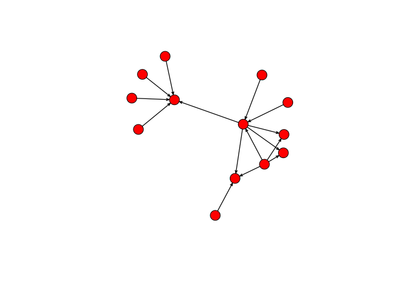
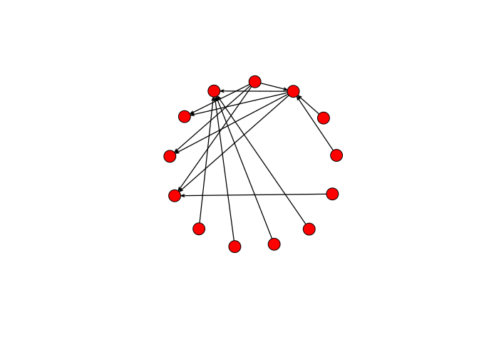
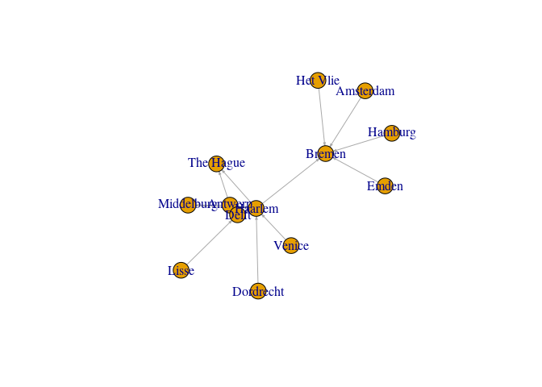
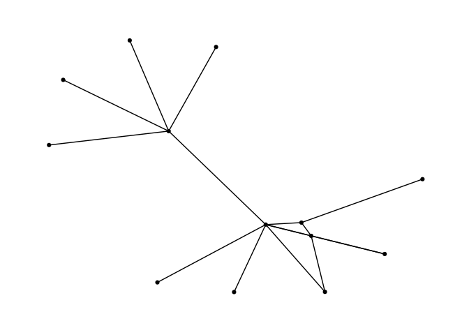
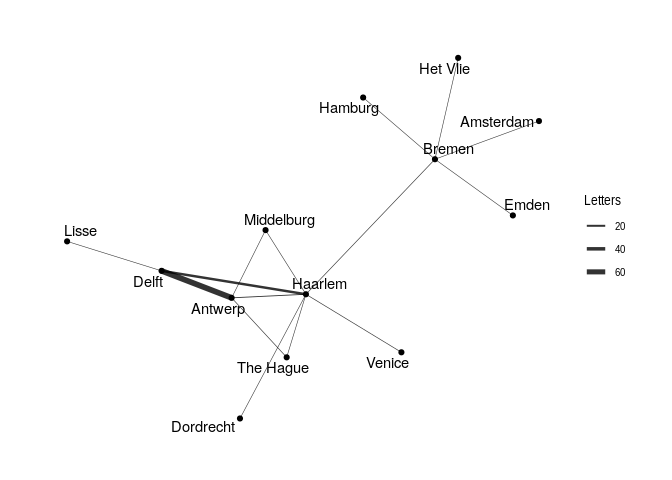
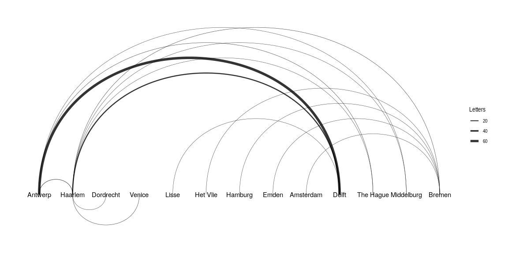

Original post here: https://dannyjra.github.io/06_Network_Analysis/01_blog_caret_Tut.html

Add summary desdcription of blog
 
<!--more-->


# Introduction

<<<<<<<<< HEAD
Though not specifically designed for it, R has developed into a powerful tool for network analysis. The strength of R in comparison to stand-alone network analysis software. There is an ever growing range of packages designed to make R a complete network analysis tool. Significant network analysis packages for R include the [statnet suite](http://www.statnet.org) of packages and [`igraph`](http://igraph.org).  In addition, [Thomas Lin Pedersen](http://www.data-imaginist.com) has recently released the [`tidygraph`](https://cran.r-project.org/web/packages/tidygraph/index.html) and [`ggraph`](https://cran.r-project.org/web/packages/ggraph/index.html) packages that leverage the power of `igraph` in a manner consistent with the [tidyverse](http://www.tidyverse.org) workflow. 
=======
Though not specifically designed for it, R has developed into a powerful tool for network analysis. The strength of R in comparison to stand-alone network analysis software. There is an ever growing range of packages designed to make R a complete network analysis tool. Significant network analysis packages for R include the [statnet suite](http://www.statnet.org) of packages and [`igraph`](http://igraph.org). In addition, [Thomas Lin Pedersen](http://www.data-imaginist.com) has recently released the [`tidygraph`](https://cran.r-project.org/web/packages/tidygraph/index.html) and [`ggraph`](https://cran.r-project.org/web/packages/ggraph/index.html) packages that leverage the power of `igraph` in a manner consistent with the [tidyverse](http://www.tidyverse.org) workflow. 
>>>>>>> e20269b6de0ef3ed9007fdbaa023051fd11cc83e

R can also be used to make interactive network graphs with the [htmlwidgets framework](http://www.htmlwidgets.org) that translates R code to JavaScript.

This post begins with a short introduction to the basic vocabulary of network analysis, followed by a discussion of the process for getting data into the proper structure for network analysis adopted from [^1]. 

The network analysis packages have all implemented their own object classes. In this post, I will show how to create the specific object classes for the statnet suite of packages with the [`network`](https://cran.r-project.org/web/packages/network/index.html) package, as well as for `igraph` and `tidygraph`, which is based on the `igraph` implementation. Finally, I will turn to the creation of interactive graphs with the [`vizNetwork`](http://datastorm-open.github.io/visNetwork/) and [`networkD3`](http://christophergandrud.github.io/networkD3/) packages.

## Network Analysis: Nodes and Edges
The two primary aspects of networks are a multitude of separate entities and the connections between them. The vocabulary can be a bit technical and even inconsistent between different disciplines, packages, and software. The entities are referred to as **nodes** or **vertices** of a graph, while the connections are **edges** or **links**. 

The network analysis packages need data to be in a particular form to create the special type of object used by each package. The object classes for `network`, `igraph`, and `tidygraph` are all based on adjacency matrices, also known as sociomatrices.[^2] An [adjacency matrix](https://en.wikipedia.org/wiki/Adjacency_matrix) is a square matrix in which the column and row names are the nodes of the network. Within the matrix a 1 indicates that there is a connection between the nodes, and a 0 indicates no connection. Adjacency matrices implement a very different data structure than data frames and do not fit within the [tidyverse](http://www.tidyverse.org) workflow that I have used in my previous posts. Helpfully, the specialized network objects can also be created from an edge-list data frame, which do fit in the tidyverse workflow. In this post I will stick to the data analysis techniques of the tidyverse to create edge lists, which will then be converted to the specific object classes for `network`, `igraph`, and `tidygraph`.

An **edge list** is a data frame that contains a minimum of two columns, one column of nodes that are the source of a connection and another column of nodes that are the target of the connection. The nodes in the data are identified by unique IDs. If the distinction between source and target is meaningful, the network is **directed**. If the distinction is not meaningful, the network is **undirected**. 

I will use integers beginning with one as node IDs.[^3] An edge list can also contain additional columns that describe **attributes** of the edges such as a magnitude aspect for an edge. If the edges have a magnitude attribute the graph is considered **weighted**.

Edge lists contain all of the information necessary to create network objects, but sometimes it is preferable to also create a separate node list. At its simplest, a **node list** is a data frame with a single column — which I will label as "id" — that lists the node IDs found in the edge list. The advantage of creating a separate node list is the ability to add attribute columns to the data frame such as the names of the nodes or any kind of groupings. Below I give an example of minimal edge and node lists created with the `tibble()` function.


```r
library(tidyverse)
```

```
## ── Attaching packages ────────────────────────────────────────────────────────── tidyverse 1.2.1 ──
```

```
## ✔ ggplot2 3.1.0       ✔ purrr   0.3.2  
## ✔ tibble  2.1.1       ✔ dplyr   0.8.0.1
## ✔ tidyr   0.8.3       ✔ stringr 1.4.0  
## ✔ readr   1.3.1       ✔ forcats 0.4.0
```

```
## ── Conflicts ───────────────────────────────────────────────────────────── tidyverse_conflicts() ──
## ✖ dplyr::filter() masks stats::filter()
## ✖ dplyr::lag()    masks stats::lag()
```

```r
edge_list <- tibble(from = c(1, 2, 2, 3, 4), to = c(2, 3, 4, 2, 1))
node_list <- tibble(id = 1:4)

edge_list
```

```
## # A tibble: 5 x 2
##    from    to
##   <dbl> <dbl>
## 1     1     2
## 2     2     3
## 3     2     4
## 4     3     2
## 5     4     1
```

```r
node_list
```

```
## # A tibble: 4 x 1
##      id
##   <int>
## 1     1
## 2     2
## 3     3
## 4     4
```

Compare this to an adjacency matrix with the same data.


```
## network: Classes for Relational Data
## Version 1.15 created on 2019-04-01.
## copyright (c) 2005, Carter T. Butts, University of California-Irvine
##                     Mark S. Handcock, University of California -- Los Angeles
##                     David R. Hunter, Penn State University
##                     Martina Morris, University of Washington
##                     Skye Bender-deMoll, University of Washington
##  For citation information, type citation("network").
##  Type help("network-package") to get started.
```

```
##   1 2 3 4
## 1 0 1 0 0
## 2 0 0 1 1
## 3 0 1 0 0
## 4 1 0 0 0
```

## Creating edge and node lists


 This will necessitate the use of the [dplyr](http://dplyr.tidyverse.org) package to manipulate the data frame of letters sent to Daniel and split it into two data frames ot [tibbles](http://r4ds.had.co.nz/tibbles.html) with the structure of edge and node lists. 
 
 
The first step is to load the `tidyverse` library to import and manipulate the data. Printing out the `letters` data frame shows that it contains four columns: "writer", "source", "destination", and "date". In this example, we will only deal with the "source" and "destination" columns.


```r
library(tidyverse)
letters <- read_csv("data/correspondence-data-1585.csv")

letters
```

```
## # A tibble: 114 x 4
##    writer                  source  destination date      
##    <chr>                   <chr>   <chr>       <date>    
##  1 Meulen, Andries van der Antwerp Delft       1585-01-03
##  2 Meulen, Andries van der Antwerp Haarlem     1585-01-09
##  3 Meulen, Andries van der Antwerp Haarlem     1585-01-11
##  4 Meulen, Andries van der Antwerp Delft       1585-01-12
##  5 Meulen, Andries van der Antwerp Haarlem     1585-01-12
##  6 Meulen, Andries van der Antwerp Delft       1585-01-17
##  7 Meulen, Andries van der Antwerp Delft       1585-01-22
##  8 Meulen, Andries van der Antwerp Delft       1585-01-23
##  9 Della Faille, Marten    Antwerp Haarlem     1585-01-24
## 10 Meulen, Andries van der Antwerp Delft       1585-01-28
## # … with 104 more rows
```

### Node list

Renaming the column with the city names as "label" to adopt the vocabulary used by network analysis packages.


```r
sources <- letters %>%
  distinct(source) %>%
  rename(label = source)

destinations <- letters %>%
  distinct(destination) %>%
  rename(label = destination)
```

To create a single dataframe with a column with the unique locations we need to use a full join, because we want to include all unique places from both the sources of the letters and the destinations. The "label" column contains the names of the nodes, but we also want to have unique IDs for each city. 


```r
nodes <- sources %>% 
  full_join( destinations, by = "label")%>% 
  rowid_to_column("id")
nodes
```

```
## # A tibble: 13 x 2
##       id label     
##    <int> <chr>     
##  1     1 Antwerp   
##  2     2 Haarlem   
##  3     3 Dordrecht 
##  4     4 Venice    
##  5     5 Lisse     
##  6     6 Het Vlie  
##  7     7 Hamburg   
##  8     8 Emden     
##  9     9 Amsterdam 
## 10    10 Delft     
## 11    11 The Hague 
## 12    12 Middelburg
## 13    13 Bremen
```

### Edge list
Creating an edge list is similar to the above, but it is complicated by the need to deal with two ID columns instead of one. We also want to create a weight column that will note the amount of letters sent between each set of nodes. 


```r
per_route <- letters %>%  
  group_by(source, destination) %>%
  summarise(weight = n()) %>% 
  ungroup()
per_route
```

```
## # A tibble: 15 x 3
##    source    destination weight
##    <chr>     <chr>        <int>
##  1 Amsterdam Bremen           1
##  2 Antwerp   Delft           68
##  3 Antwerp   Haarlem          5
##  4 Antwerp   Middelburg       1
##  5 Antwerp   The Hague        2
##  6 Dordrecht Haarlem          1
##  7 Emden     Bremen           1
##  8 Haarlem   Bremen           2
##  9 Haarlem   Delft           26
## 10 Haarlem   Middelburg       1
## 11 Haarlem   The Hague        1
## 12 Hamburg   Bremen           1
## 13 Het Vlie  Bremen           1
## 14 Lisse     Delft            1
## 15 Venice    Haarlem          2
```

Like the node list, `per_route` now has the basic form that we want, but we again have the problem that the "source" and "destination" columns contain labels rather than IDs. What we need to do is link the IDs that have been assigned in `nodes` to each location in both the "source" and "destination" columns. This can be accomplished with another join function. In fact, it is necessary to perform two joins, one for the "source" column and one for "destination." In this case, I will use a `left_join()` with `per_route` as the left data frame, because we want to maintain the number of rows in `per_route`. 


```r
edges <- per_route %>% 
  left_join(nodes, by = c("source" = "label")) %>% 
  rename(from = id)

edges <- edges %>% 
  left_join(nodes, by = c("destination" = "label")) %>% 
  rename(to = id)
```

Now that `edges` has "from" and "to" columns with node IDs, we need to reorder the columns to bring "from" and "to" to the left of the data frame. Currently, the `edges` data frame still contains the "source" and "destination" columns with the names of the cities that correspond with the IDs. However, this data is superfluous, since it is already present in `nodes`. 


```r
edges <- select(edges, from, to, weight)
edges
```

```
## # A tibble: 15 x 3
##     from    to weight
##    <int> <int>  <int>
##  1     9    13      1
##  2     1    10     68
##  3     1     2      5
##  4     1    12      1
##  5     1    11      2
##  6     3     2      1
##  7     8    13      1
##  8     2    13      2
##  9     2    10     26
## 10     2    12      1
## 11     2    11      1
## 12     7    13      1
## 13     6    13      1
## 14     5    10      1
## 15     4     2      2
```

The `edges` data frame does not look very impressive; it is three columns of integers. However, `edges` combined with `nodes` provides us with all of the information necessary to create network objects with the `network`, `igraph`, and `tidygraph` packages.

## Creating network objects
The network object classes for `network`, `igraph`, and `tidygraph` are all closely related. It is possible to translate between a `network` object and an `igraph` object. However, it is best to keep the two packages and their objects separate. In fact, the capabilities of `network` and `igraph` overlap to such an extent that it is best practice to have only one of the packages loaded at a time. I will begin by going over the `network` package and then move to the `igraph` and `tidygraph` packages.

### network

```r
library(network)
```

Notice that the `network` package uses the nomenclature of vertices instead of nodes. The same is true of `igraph`. We then need to specify the type of data that has been entered into the first two arguments by specifying that the `matrix.type` is an `"edgelist"`. Finally, we set `ignore.eval` to `FALSE` so that our network can be weighted and take into account the number of letters along each route.


```r
routes_network <- network(edges, vertex.attr = nodes, matrix.type = "edgelist", ignore.eval = FALSE)
routes_network
```

```
##  Network attributes:
##   vertices = 13 
##   directed = TRUE 
##   hyper = FALSE 
##   loops = FALSE 
##   multiple = FALSE 
##   bipartite = FALSE 
##   total edges= 15 
##     missing edges= 0 
##     non-missing edges= 15 
## 
##  Vertex attribute names: 
##     id label vertex.names 
## 
##  Edge attribute names: 
##     weight
```


 In this case, the only change that I make to the default `plot()` function for the `network` package is to increase the size of nodes with the `vertex.cex` argument to make the nodes more visible. 


```r
plot(routes_network, vertex.cex = 3)
```

<!-- -->

The `plot()` function with a `network` object uses the Fruchterman and Reingold algorithm to decide on the placement of the nodes. You can change the layout algorithm with the `mode` argument. Below, I layout the nodes in a circle. 


```r
plot(routes_network, vertex.cex = 3, mode = "circle")
```

<!-- -->

### igraph
Let's now move on to discuss the `igraph` package. First, we need to clean up the environment in R by removing the `network` package so that it does not interfere with the `igraph` commands. We might as well also remove `routes_network` since we will not longer be using it. The `network` package can be removed with the `detach()` function, and `routes_network` is removed with `rm()`.[^7] After this, we can safely load `igraph`.


```r
detach(package:network)
rm(routes_network)
library(igraph)
```

```
## 
## Attaching package: 'igraph'
```

```
## The following objects are masked from 'package:dplyr':
## 
##     as_data_frame, groups, union
```

```
## The following objects are masked from 'package:purrr':
## 
##     compose, simplify
```

```
## The following object is masked from 'package:tidyr':
## 
##     crossing
```

```
## The following object is masked from 'package:tibble':
## 
##     as_data_frame
```

```
## The following objects are masked from 'package:stats':
## 
##     decompose, spectrum
```

```
## The following object is masked from 'package:base':
## 
##     union
```

To create an `igraph` object from an edge-list data frame we can use the `graph_from_data_frame()` function, which is a bit more straight forward than `network()`. There are three arguments in the `graph_from_data_frame()` function: d, vertices, and directed. Here, d refers to the edge list, vertices to the node list, and directed can be either `TRUE` or `FALSE` depending on whether the data is directed or undirected.


```r
routes_igraph <- graph_from_data_frame(d = edges, vertices = nodes, directed = TRUE)
routes_igraph
```

```
## IGRAPH a34f6db DNW- 13 15 -- 
## + attr: name (v/c), label (v/c), weight (e/n)
## + edges from a34f6db (vertex names):
##  [1] 9->13 1->10 1->2  1->12 1->11 3->2  8->13 2->13 2->10 2->12 2->11
## [12] 7->13 6->13 5->10 4->2
```


Just as with the `network` package, we can create a plot with an `igraph` object through the `plot()` function. The only change that I make to the default here is to decrease the size of the arrows. By default `igraph` labels the nodes with the label column if there is one or with the IDs.


```r
plot(routes_igraph, edge.arrow.size = 0.2)
```

<!-- -->

### tidygraph and ggraph
The `tidygraph` and `ggraph` packages are newcomers to the network analysis landscape, but together the two packages provide real advantages over the `network` and `igraph` packages. `tidygraph` and `ggraph` represent an attempt to [bring network analysis into the tidyverse workflow](http://www.data-imaginist.com/2017/Introducing-tidygraph/). [`tidygraph`](https://cran.r-project.org/web/packages/tidygraph/index.html) provides a way to create a network object that more closely resembles a [tibble or data frame](http://r4ds.had.co.nz/tibbles.html). This makes it possible to use many of the `dplyr` functions to manipulate network data. [`ggraph`](https://cran.r-project.org/web/packages/ggraph/index.html) gives a way to plot network graphs using the conventions and power of `ggplot2`. In other words, `tidygraph` and `ggraph` allow you to deal with network objects in a manner that is more consistent with the commands used for working with tibbles and data frames. 


```r
library(tidygraph)
```

```
## 
## Attaching package: 'tidygraph'
```

```
## The following object is masked from 'package:igraph':
## 
##     groups
```

```
## The following object is masked from 'package:stats':
## 
##     filter
```

```r
library(ggraph)
```

First, let's create a network object using `tidygraph`, which is called a `tbl_graph`. A `tbl_graph` consists of two tibbles: an edges tibble and a nodes tibble. Conveniently, the `tbl_graph` object class is a wrapper around an `igraph` object, meaning that at its basis a `tbl_graph` object is essentially an `igraph` object.[^8] The close link between `tbl_graph` and `igraph` objects results in two main ways to create a `tbl_graph` object. The first is to use an edge list and node list, using `tbl_graph()`. The arguments for the function are almost identical to those of `graph_from_data_frame()` with only a slight change to the names of the arguments.


```r
routes_tidy <- tbl_graph(nodes = nodes, edges = edges, directed = TRUE)
routes_tidy
```

```
## # A tbl_graph: 13 nodes and 15 edges
## #
## # A directed acyclic simple graph with 1 component
## #
## # Node Data: 13 x 2 (active)
##      id label    
##   <int> <chr>    
## 1     1 Antwerp  
## 2     2 Haarlem  
## 3     3 Dordrecht
## 4     4 Venice   
## 5     5 Lisse    
## 6     6 Het Vlie 
## # … with 7 more rows
## #
## # Edge Data: 15 x 3
##    from    to weight
##   <int> <int>  <int>
## 1     9    13      1
## 2     1    10     68
## 3     1     2      5
## # … with 12 more rows
```

Printing `routes_tidy` shows that it is a `tbl_graph` object with 13 nodes and 15 edges. The command also prints the first six rows of "Node Data" and the first three of "Edge Data". Notice too that it states that the Node Data is active. The notion of an active tibble within a `tbl_graph` object makes it possible to manipulate the data in one tibble at a time. The nodes tibble is activated by default, but you can change which tibble is active with the `activate()` function. Thus, if I wanted to rearrange the rows in the edges tibble to list those with the highest "weight" first, I could use `activate()` and then `arrange()`. Here I simply print out the result rather than saving it.


```r
routes_tidy %>% 
  activate(edges) %>% 
  arrange(desc(weight))
```

```
## # A tbl_graph: 13 nodes and 15 edges
## #
## # A directed acyclic simple graph with 1 component
## #
## # Edge Data: 15 x 3 (active)
##    from    to weight
##   <int> <int>  <int>
## 1     1    10     68
## 2     2    10     26
## 3     1     2      5
## 4     1    11      2
## 5     2    13      2
## 6     4     2      2
## # … with 9 more rows
## #
## # Node Data: 13 x 2
##      id label    
##   <int> <chr>    
## 1     1 Antwerp  
## 2     2 Haarlem  
## 3     3 Dordrecht
## # … with 10 more rows
```

Since we do not need to further manipulate `routes_tidy`, we can plot the graph with `ggraph`. Like [ggmap](https://jessesadler.com/post/geocoding-with-r/#mapping-data), `ggraph` is an extension of `ggplot2`, making it easier to carry over basic `ggplot` skills to the creation of network plots. As in all network graphs, there are three main aspects to a `ggraph` plot: [nodes](http://www.data-imaginist.com/2017/ggraph-introduction-nodes/), [edges](http://www.data-imaginist.com/2017/ggraph-introduction-edges/), and [layouts](http://www.data-imaginist.com/2017/ggraph-introduction-layouts/). The [vignettes for the ggraph
package](https://cran.r-project.org/web/packages/ggraph/index.html) helpfully cover the fundamental aspects of `ggraph` plots. `ggraph` adds special geoms to the basic set of `ggplot` geoms that are specifically designed for networks. Thus, there is a set of `geom_node` and `geom_edge` geoms. The basic plotting function is `ggraph()`, which takes the data to be used for the graph and the type of layout desired. Both of the arguments for `ggraph()` are built around `igraph`. Therefore, `ggraph()` can use either an `igraph` object or a `tbl_graph` object. In addition, the available layouts algorithms primarily derive from `igraph`. Lastly, `ggraph` introduces a special `ggplot` theme that provides better defaults for network graphs than the normal `ggplot` defaults. The `ggraph` theme can be set for a series of plots with the `set_graph_style()` command run before the graphs are plotted or by using `theme_graph()` in the individual plots. Here, I will use the latter method.

Let's see what a basic `ggraph` plot looks like. The plot begins with `ggraph()` and the data. I then add basic edge and node geoms. No arguments are necessary within the edge and node geoms, because they take the information from the data provided in `ggraph()`.


```r
ggraph(routes_tidy) + geom_edge_link() + geom_node_point() + theme_graph()
```

```
## Using `nicely` as default layout
```

<!-- -->

We can show the "weight" of the edges — or the amount of letters sent along each route — by using width in the `geom_edge_link()` function. To get the width of the line to change according to the weight variable, we place the argument within an `aes()` function. In order to control the maximum and minimum width of the edges, I use `scale_edge_width()` and set a `range`. I choose a relatively small width for the minimum, because there is a significant difference between the maximum and minimum number of letters sent along the routes. We can also label the nodes with the names of the locations since there are relatively few nodes. Conveniently, `geom_node_text()` comes with a repel argument that ensures that the labels do not overlap with the nodes in a manner similar to the [ggrepel package](https://cran.r-project.org/web/packages/ggrepel/index.html). I add a bit of transparency to the edges with the alpha argument. I also use `labs()` to relabel the legend "Letters".


```r
ggraph(routes_tidy, layout = "graphopt") + 
  geom_node_point() +
  geom_edge_link(aes(width = weight), alpha = 0.8) + 
  scale_edge_width(range = c(0.2, 2)) +
  geom_node_text(aes(label = label), repel = TRUE) +
  labs(edge_width = "Letters") +
  theme_graph()
```

<!-- -->

You can use `ggraph's` concept of [circularity](http://www.data-imaginist.com/2017/ggraph-introduction-layouts/) to create arc diagrams. 


```r
ggraph(routes_igraph, layout = "linear") + 
  geom_edge_arc(aes(width = weight), alpha = 0.8) + 
  scale_edge_width(range = c(0.2, 2)) +
  geom_node_text(aes(label = label)) +
  labs(edge_width = "Letters") +
  theme_graph()
```

<!-- -->

# Interactive network graphs with `visNetwork` and `networkD3`


Here, I will show how to make graphs with the [`visNetwork`](http://datastorm-open.github.io/visNetwork/) and [`networkD3`](http://christophergandrud.github.io/networkD3/) packages. These two packages use different JavaScript libraries to create their graphs. `visNetwork` uses [vis.js](http://visjs.org/), while `networkD3` uses the popular [d3 visualization library](http://d3js.org/) to make its graphs. One difficulty in working with both `visNetwork` and `networkD3` is that they expect edge lists and node lists to use specific nomenclature. The above data manipulation conforms to the basic structure for `visNetwork`, but some work will need to be done for `networkD3`. Despite this inconvenience, both packages possess a wide range of graphing capabilities and both can work with `igraph` objects and layouts.


```r
library(visNetwork)
library(networkD3)
```

## visNetwork
The `visNetwork()` function uses a nodes list and edges list to create an interactive graph. The nodes list must include an "id" column, and the edge list must have "from" and "to" columns. The function also plots the labels for the nodes, using the names of the cities from the "label" column in the node list. The resulting graph is fun to play around with. You can move the nodes and the graph will use an algorithm to keep the nodes properly spaced. You can also zoom in and out on the plot and move it around to re-center it.


```r
visNetwork(nodes, edges)
```

<!--html_preserve--><div id="htmlwidget-66ca9c5516946d2f79b1" style="width:672px;height:480px;" class="visNetwork html-widget"></div>
<script type="application/json" data-for="htmlwidget-66ca9c5516946d2f79b1">{"x":{"nodes":{"id":[1,2,3,4,5,6,7,8,9,10,11,12,13],"label":["Antwerp","Haarlem","Dordrecht","Venice","Lisse","Het Vlie","Hamburg","Emden","Amsterdam","Delft","The Hague","Middelburg","Bremen"]},"edges":{"from":[9,1,1,1,1,3,8,2,2,2,2,7,6,5,4],"to":[13,10,2,12,11,2,13,13,10,12,11,13,13,10,2],"weight":[1,68,5,1,2,1,1,2,26,1,1,1,1,1,2]},"nodesToDataframe":true,"edgesToDataframe":true,"options":{"width":"100%","height":"100%","nodes":{"shape":"dot"},"manipulation":{"enabled":false}},"groups":null,"width":null,"height":null,"idselection":{"enabled":false},"byselection":{"enabled":false},"main":null,"submain":null,"footer":null,"background":"rgba(0, 0, 0, 0)"},"evals":[],"jsHooks":[]}</script><!--/html_preserve-->

`visNetwork` can use `igraph` layouts, providing a large variety of possible layouts. In addition, you can use `visIgraph()` to plot an `igraph` object directly. Here, I will stick with the `nodes` and `edges` workflow and use an `igraph` layout to customize the graph. I will also add a variable to change the width of the edge as we did with `ggraph`. `visNetwork()` uses column names from the edge and node lists to plot network attributes instead of arguments within the function call. This means that it is necessary to do some data manipulation to get a "width" column in the edge list. The width attribute for `visNetwork()` does not scale the values, so we have to do this manually. Both of these actions can be done with the `mutate()` function and some simple arithmetic. Here, I create a new column in `edges` and scale the weight values by dividing by 5. Adding 1 to the result provides a way to create a minimum width.


```r
edges <- mutate(edges, width = weight/5 + 1)
```

Once this is done, we can create a graph with variable edge widths. I also choose a layout algorithm from `igraph` and add arrows to the edges, placing them in the middle of the edge.


```r
visNetwork(nodes, edges) %>% 
  visIgraphLayout(layout = "layout_with_fr") %>% 
  visEdges(arrows = "middle")
```

<!--html_preserve--><div id="htmlwidget-6df131e348108934739a" style="width:672px;height:480px;" class="visNetwork html-widget"></div>
<script type="application/json" data-for="htmlwidget-6df131e348108934739a">{"x":{"nodes":{"id":[1,2,3,4,5,6,7,8,9,10,11,12,13],"label":["Antwerp","Haarlem","Dordrecht","Venice","Lisse","Het Vlie","Hamburg","Emden","Amsterdam","Delft","The Hague","Middelburg","Bremen"],"x":[0.423424904284426,0.189646977186259,-0.484050069794308,0.726042929546187,1,-0.834307275657799,-1,0.132832044474091,-0.359890364213244,0.646385354581663,0.771802050181974,-0.0246503608400312,-0.312083548982779],"y":[-0.413657987787449,-0.102558122164406,-0.198349716842837,0.145468373893085,-1,0.871244057353747,0.567173357893561,0.876669961333215,1,-0.620948505970483,-0.231483993646624,-0.461416882729945,0.561237055144782]},"edges":{"from":[9,1,1,1,1,3,8,2,2,2,2,7,6,5,4],"to":[13,10,2,12,11,2,13,13,10,12,11,13,13,10,2],"weight":[1,68,5,1,2,1,1,2,26,1,1,1,1,1,2],"width":[1.2,14.6,2,1.2,1.4,1.2,1.2,1.4,6.2,1.2,1.2,1.2,1.2,1.2,1.4]},"nodesToDataframe":true,"edgesToDataframe":true,"options":{"width":"100%","height":"100%","nodes":{"shape":"dot","physics":false},"manipulation":{"enabled":false},"edges":{"smooth":false,"arrows":"middle"},"physics":{"stabilization":false}},"groups":null,"width":null,"height":null,"idselection":{"enabled":false},"byselection":{"enabled":false},"main":null,"submain":null,"footer":null,"background":"rgba(0, 0, 0, 0)","igraphlayout":{"type":"square"}},"evals":[],"jsHooks":[]}</script><!--/html_preserve-->

## networkD3

### Interacting with igraph

A little more work is necessary to prepare the data to create a `networkD3` graph. To make a `networkD3` graph with a edge and node list requires that the IDs be a series of numeric integers that begin with 0. Currently, the node IDs for our data begin with 1, and so we have to do a bit of data manipulation. 


```r
nodes_d3 <- mutate(nodes, id = id - 1)
edges_d3 <- mutate(edges, from = from - 1, to = to - 1)
```

It is now possible to plot a `networkD3` graph. Unlike `visNetwork()`, the `forceNetwork()` function uses a series of arguments to adjust the graph and plot network attributes. The "Links" and "Nodes" arguments provide the data for the plot in the form of edge and node lists. The function also requires "NodeID" and "Group" arguments. 


```r
forceNetwork(Links = edges_d3, Nodes = nodes_d3, Source = "from", Target = "to", 
             NodeID = "label", Group = "id", Value = "weight", 
             opacity = 1, fontSize = 16, zoom = TRUE)
```

```
## Links is a tbl_df. Converting to a plain data frame.
```

```
## Nodes is a tbl_df. Converting to a plain data frame.
```

<!--html_preserve--><div id="htmlwidget-17fd207a87b323b06dfc" style="width:672px;height:480px;" class="forceNetwork html-widget"></div>
<script type="application/json" data-for="htmlwidget-17fd207a87b323b06dfc">{"x":{"links":{"source":[8,0,0,0,0,2,7,1,1,1,1,6,5,4,3],"target":[12,9,1,11,10,1,12,12,9,11,10,12,12,9,1],"value":[1,68,5,1,2,1,1,2,26,1,1,1,1,1,2],"colour":["#666","#666","#666","#666","#666","#666","#666","#666","#666","#666","#666","#666","#666","#666","#666"]},"nodes":{"name":["Antwerp","Haarlem","Dordrecht","Venice","Lisse","Het Vlie","Hamburg","Emden","Amsterdam","Delft","The Hague","Middelburg","Bremen"],"group":[0,1,2,3,4,5,6,7,8,9,10,11,12]},"options":{"NodeID":"label","Group":"id","colourScale":"d3.scaleOrdinal(d3.schemeCategory20);","fontSize":16,"fontFamily":"serif","clickTextSize":40,"linkDistance":50,"linkWidth":"function(d) { return Math.sqrt(d.value); }","charge":-30,"opacity":1,"zoom":true,"legend":false,"arrows":false,"nodesize":false,"radiusCalculation":" Math.sqrt(d.nodesize)+6","bounded":false,"opacityNoHover":0,"clickAction":null}},"evals":[],"jsHooks":[]}</script><!--/html_preserve-->


You can use the  igraph_to_networkD3 function converts igraph graphs to lists that work well with networkD3. For example:


```r
# Load igraph
library(igraph)

# Use igraph to make the graph and find membership
karate <- make_graph("Zachary")
wc <- cluster_walktrap(karate)
members <- membership(wc)

# Convert to object suitable for networkD3
karate_d3 <- igraph_to_networkD3(karate, group = members)

# Create force directed network plot
forceNetwork(Links = karate_d3$links, Nodes = karate_d3$nodes, 
             Source = 'source', Target = 'target', 
             NodeID = 'name', Group = 'group')
```

<!--html_preserve--><div id="htmlwidget-ab82e7d3b16e0eb93d08" style="width:672px;height:480px;" class="forceNetwork html-widget"></div>
<script type="application/json" data-for="htmlwidget-ab82e7d3b16e0eb93d08">{"x":{"links":{"source":[0,0,1,0,1,2,0,0,0,5,4,0,1,3,2,2,0,2,5,4,0,0,0,3,3,2,0,1,5,6,0,1,1,0,1,0,23,24,23,24,2,2,26,23,8,1,0,28,25,24,20,8,15,2,22,31,14,30,29,23,18,9,8,28,20,14,30,15,18,19,26,27,22,13,29,23,31,32],"target":[1,2,2,3,3,3,4,5,6,6,6,7,7,7,7,8,8,9,10,10,10,11,12,12,13,13,13,13,16,16,17,17,19,19,21,21,25,25,27,27,27,28,29,29,30,30,31,31,31,31,32,32,32,32,32,32,32,32,32,32,32,33,33,33,33,33,33,33,33,33,33,33,33,33,33,33,33,33],"colour":["#666","#666","#666","#666","#666","#666","#666","#666","#666","#666","#666","#666","#666","#666","#666","#666","#666","#666","#666","#666","#666","#666","#666","#666","#666","#666","#666","#666","#666","#666","#666","#666","#666","#666","#666","#666","#666","#666","#666","#666","#666","#666","#666","#666","#666","#666","#666","#666","#666","#666","#666","#666","#666","#666","#666","#666","#666","#666","#666","#666","#666","#666","#666","#666","#666","#666","#666","#666","#666","#666","#666","#666","#666","#666","#666","#666","#666","#666"]},"nodes":{"name":["1","2","3","4","5","6","7","8","9","10","11","12","13","14","15","16","17","18","19","20","21","22","23","24","25","26","27","28","29","30","31","32","33","34"],"group":[1,1,2,1,5,5,5,1,2,2,5,1,1,2,3,3,5,1,3,1,3,1,3,4,4,4,3,4,2,3,2,2,3,3]},"options":{"NodeID":"name","Group":"group","colourScale":"d3.scaleOrdinal(d3.schemeCategory20);","fontSize":7,"fontFamily":"serif","clickTextSize":17.5,"linkDistance":50,"linkWidth":"function(d) { return Math.sqrt(d.value); }","charge":-30,"opacity":0.6,"zoom":false,"legend":false,"arrows":false,"nodesize":false,"radiusCalculation":" Math.sqrt(d.nodesize)+6","bounded":false,"opacityNoHover":0,"clickAction":null}},"evals":[],"jsHooks":[]}</script><!--/html_preserve-->


It currently supports the following types of network graphs[^4]:

### Force directed networks 


```r
# Load data
data(MisLinks)
data(MisNodes)

# Plot
forceNetwork(Links = MisLinks, Nodes = MisNodes,
            Source = "source", Target = "target",
            Value = "value", NodeID = "name",
            Group = "group", opacity = 0.8)
```

<!--html_preserve--><div id="htmlwidget-8cd034aff49c37e43950" style="width:672px;height:480px;" class="forceNetwork html-widget"></div>
<script type="application/json" data-for="htmlwidget-8cd034aff49c37e43950">{"x":{"links":{"source":[1,2,3,3,4,5,6,7,8,9,11,11,11,11,12,13,14,15,17,18,18,19,19,19,20,20,20,20,21,21,21,21,21,22,22,22,22,22,22,23,23,23,23,23,23,23,23,23,24,24,25,25,25,26,26,26,26,27,27,27,27,27,28,28,29,29,29,30,31,31,31,31,32,33,33,34,34,35,35,35,36,36,36,36,37,37,37,37,37,38,38,38,38,38,38,39,40,41,41,42,42,42,43,43,43,44,44,45,47,48,48,48,48,49,49,50,50,51,51,51,52,52,53,54,54,54,55,55,55,55,55,55,55,55,55,55,56,56,57,57,57,58,58,58,58,58,59,59,59,59,60,60,60,61,61,61,61,61,61,62,62,62,62,62,62,62,62,63,63,63,63,63,63,63,63,64,64,64,64,64,64,64,64,64,64,65,65,65,65,65,65,65,65,65,65,66,66,66,66,66,66,66,66,66,67,68,68,68,68,68,68,69,69,69,69,69,69,69,70,70,70,70,70,70,70,70,71,71,71,71,71,71,71,71,72,72,72,73,74,74,75,75,75,75,75,75,75,76,76,76,76,76,76,76],"target":[0,0,0,2,0,0,0,0,0,0,10,3,2,0,11,11,11,11,16,16,17,16,17,18,16,17,18,19,16,17,18,19,20,16,17,18,19,20,21,16,17,18,19,20,21,22,12,11,23,11,24,23,11,24,11,16,25,11,23,25,24,26,11,27,23,27,11,23,30,11,23,27,11,11,27,11,29,11,34,29,34,35,11,29,34,35,36,11,29,34,35,36,37,11,29,25,25,24,25,41,25,24,11,26,27,28,11,28,46,47,25,27,11,26,11,49,24,49,26,11,51,39,51,51,49,26,51,49,39,54,26,11,16,25,41,48,49,55,55,41,48,55,48,27,57,11,58,55,48,57,48,58,59,48,58,60,59,57,55,55,58,59,48,57,41,61,60,59,48,62,57,58,61,60,55,55,62,48,63,58,61,60,59,57,11,63,64,48,62,58,61,60,59,57,55,64,58,59,62,65,48,63,61,60,57,25,11,24,27,48,41,25,68,11,24,27,48,41,25,69,68,11,24,27,41,58,27,69,68,70,11,48,41,25,26,27,11,48,48,73,69,68,25,48,41,70,71,64,65,66,63,62,48,58],"value":[1,8,10,6,1,1,1,1,2,1,1,3,3,5,1,1,1,1,4,4,4,4,4,4,3,3,3,4,3,3,3,3,5,3,3,3,3,4,4,3,3,3,3,4,4,4,2,9,2,7,13,1,12,4,31,1,1,17,5,5,1,1,8,1,1,1,2,1,2,3,2,1,1,2,1,3,2,3,3,2,2,2,2,1,2,2,2,2,1,2,2,2,2,2,1,1,1,2,3,2,2,1,3,1,1,3,1,2,1,2,1,1,1,3,2,1,1,9,2,2,1,1,1,2,1,1,6,12,1,1,21,19,1,2,5,4,1,1,1,1,1,7,7,6,1,4,15,5,6,2,1,4,2,2,6,2,5,1,1,9,17,13,7,2,1,6,3,5,5,6,2,4,3,2,1,5,12,5,4,10,6,2,9,1,1,5,7,3,5,5,5,2,5,1,2,3,3,1,2,2,1,1,1,1,3,5,1,1,1,1,1,6,6,1,1,2,1,1,4,4,4,1,1,1,1,1,1,2,2,2,1,1,1,1,2,1,1,2,2,3,3,3,3,1,1,1,1,1,1,1,1,1,1,1],"colour":["#666","#666","#666","#666","#666","#666","#666","#666","#666","#666","#666","#666","#666","#666","#666","#666","#666","#666","#666","#666","#666","#666","#666","#666","#666","#666","#666","#666","#666","#666","#666","#666","#666","#666","#666","#666","#666","#666","#666","#666","#666","#666","#666","#666","#666","#666","#666","#666","#666","#666","#666","#666","#666","#666","#666","#666","#666","#666","#666","#666","#666","#666","#666","#666","#666","#666","#666","#666","#666","#666","#666","#666","#666","#666","#666","#666","#666","#666","#666","#666","#666","#666","#666","#666","#666","#666","#666","#666","#666","#666","#666","#666","#666","#666","#666","#666","#666","#666","#666","#666","#666","#666","#666","#666","#666","#666","#666","#666","#666","#666","#666","#666","#666","#666","#666","#666","#666","#666","#666","#666","#666","#666","#666","#666","#666","#666","#666","#666","#666","#666","#666","#666","#666","#666","#666","#666","#666","#666","#666","#666","#666","#666","#666","#666","#666","#666","#666","#666","#666","#666","#666","#666","#666","#666","#666","#666","#666","#666","#666","#666","#666","#666","#666","#666","#666","#666","#666","#666","#666","#666","#666","#666","#666","#666","#666","#666","#666","#666","#666","#666","#666","#666","#666","#666","#666","#666","#666","#666","#666","#666","#666","#666","#666","#666","#666","#666","#666","#666","#666","#666","#666","#666","#666","#666","#666","#666","#666","#666","#666","#666","#666","#666","#666","#666","#666","#666","#666","#666","#666","#666","#666","#666","#666","#666","#666","#666","#666","#666","#666","#666","#666","#666","#666","#666","#666","#666","#666","#666","#666","#666","#666","#666","#666","#666","#666","#666","#666","#666","#666","#666","#666","#666","#666","#666"]},"nodes":{"name":["Myriel","Napoleon","Mlle.Baptistine","Mme.Magloire","CountessdeLo","Geborand","Champtercier","Cravatte","Count","OldMan","Labarre","Valjean","Marguerite","Mme.deR","Isabeau","Gervais","Tholomyes","Listolier","Fameuil","Blacheville","Favourite","Dahlia","Zephine","Fantine","Mme.Thenardier","Thenardier","Cosette","Javert","Fauchelevent","Bamatabois","Perpetue","Simplice","Scaufflaire","Woman1","Judge","Champmathieu","Brevet","Chenildieu","Cochepaille","Pontmercy","Boulatruelle","Eponine","Anzelma","Woman2","MotherInnocent","Gribier","Jondrette","Mme.Burgon","Gavroche","Gillenormand","Magnon","Mlle.Gillenormand","Mme.Pontmercy","Mlle.Vaubois","Lt.Gillenormand","Marius","BaronessT","Mabeuf","Enjolras","Combeferre","Prouvaire","Feuilly","Courfeyrac","Bahorel","Bossuet","Joly","Grantaire","MotherPlutarch","Gueulemer","Babet","Claquesous","Montparnasse","Toussaint","Child1","Child2","Brujon","Mme.Hucheloup"],"group":[1,1,1,1,1,1,1,1,1,1,2,2,3,2,2,2,3,3,3,3,3,3,3,3,4,4,5,4,0,2,3,2,2,2,2,2,2,2,2,4,6,4,4,5,0,0,7,7,8,5,5,5,5,5,5,8,5,8,8,8,8,8,8,8,8,8,8,9,4,4,4,4,5,10,10,4,8]},"options":{"NodeID":"name","Group":"group","colourScale":"d3.scaleOrdinal(d3.schemeCategory20);","fontSize":7,"fontFamily":"serif","clickTextSize":17.5,"linkDistance":50,"linkWidth":"function(d) { return Math.sqrt(d.value); }","charge":-30,"opacity":0.8,"zoom":false,"legend":false,"arrows":false,"nodesize":false,"radiusCalculation":" Math.sqrt(d.nodesize)+6","bounded":false,"opacityNoHover":0,"clickAction":null}},"evals":[],"jsHooks":[]}</script><!--/html_preserve-->

### Sankey diagrams with sankeyNetwork

One of the main benefits of `networkD3` is that it implements a [d3-styled Sankey diagram](https://bost.ocks.org/mike/sankey/).  This graph does not require a group argument, and the only other change is the addition of a "unit." This provides a label for the values that pop up in a tool tip when your cursor hovers over a diagram element.


```r
# Load energy projection data
# Load energy projection data
URL <- paste0(
        "https://cdn.rawgit.com/christophergandrud/networkD3/",
        "master/JSONdata/energy.json")
Energy <- jsonlite::fromJSON(URL)
# Plot
sankeyNetwork(Links = Energy$links, Nodes = Energy$nodes, Source = "source",
             Target = "target", Value = "value", NodeID = "name",
             units = "TWh", fontSize = 12, nodeWidth = 30)
```

<!--html_preserve--><div id="htmlwidget-f626679e1ecd9aa95f65" style="width:672px;height:480px;" class="sankeyNetwork html-widget"></div>
<script type="application/json" data-for="htmlwidget-f626679e1ecd9aa95f65">{"x":{"links":{"source":[0,1,1,1,1,6,7,8,10,9,11,11,11,15,15,15,15,15,15,15,15,15,15,15,23,25,5,5,5,5,5,27,17,17,28,29,2,2,2,2,2,2,2,2,34,24,35,36,38,37,39,39,40,40,41,42,43,43,4,4,4,26,26,26,44,45,46,47],"target":[1,2,3,4,5,2,4,9,9,4,12,13,14,16,14,17,12,18,19,13,3,20,21,22,24,24,13,3,26,19,12,15,28,3,18,15,12,30,18,31,32,19,33,20,1,5,26,37,37,2,4,1,14,13,15,14,42,41,19,26,12,15,3,11,15,1,15,15],"value":[124.729,0.597,26.862,280.322,81.144,35,35,11.606,63.965,75.571,10.639,22.505,46.184,104.453,113.726,27.14,342.165,37.797,4.412,40.858,56.691,7.863,90.008,93.494,40.719,82.233,0.129,1.401,151.891,2.096,48.58,7.013,20.897,6.242,20.897,6.995,121.066,128.69,135.835,14.458,206.267,3.64,33.218,4.413,4.375,122.952,839.978,504.287,107.703,611.99,56.587,77.81,193.026,70.672,59.901,19.263,19.263,59.901,0.882,400.12,46.477,525.531,787.129,79.329,9.452,182.01,19.013,289.366]},"nodes":{"name":["Agricultural 'waste'","Bio-conversion","Liquid","Losses","Solid","Gas","Biofuel imports","Biomass imports","Coal imports","Coal","Coal reserves","District heating","Industry","Heating and cooling - commercial","Heating and cooling - homes","Electricity grid","Over generation / exports","H2 conversion","Road transport","Agriculture","Rail transport","Lighting & appliances - commercial","Lighting & appliances - homes","Gas imports","Ngas","Gas reserves","Thermal generation","Geothermal","H2","Hydro","International shipping","Domestic aviation","International aviation","National navigation","Marine algae","Nuclear","Oil imports","Oil","Oil reserves","Other waste","Pumped heat","Solar PV","Solar Thermal","Solar","Tidal","UK land based bioenergy","Wave","Wind"],"group":["Agricultural 'waste'","Bio-conversion","Liquid","Losses","Solid","Gas","Biofuel imports","Biomass imports","Coal imports","Coal","Coal reserves","District heating","Industry","Heating and cooling - commercial","Heating and cooling - homes","Electricity grid","Over generation / exports","H2 conversion","Road transport","Agriculture","Rail transport","Lighting & appliances - commercial","Lighting & appliances - homes","Gas imports","Ngas","Gas reserves","Thermal generation","Geothermal","H2","Hydro","International shipping","Domestic aviation","International aviation","National navigation","Marine algae","Nuclear","Oil imports","Oil","Oil reserves","Other waste","Pumped heat","Solar PV","Solar Thermal","Solar","Tidal","UK land based bioenergy","Wave","Wind"]},"options":{"NodeID":"name","NodeGroup":"name","LinkGroup":null,"colourScale":"d3.scaleOrdinal(d3.schemeCategory20);","fontSize":12,"fontFamily":null,"nodeWidth":30,"nodePadding":10,"units":"TWh","margin":{"top":null,"right":null,"bottom":null,"left":null},"iterations":32,"sinksRight":true}},"evals":[],"jsHooks":[]}</script><!--/html_preserve-->
### Radial networks


```r
URL <- paste0(
        "https://cdn.rawgit.com/christophergandrud/networkD3/",
        "master/JSONdata//flare.json")

## Convert to list format
Flare <- jsonlite::fromJSON(URL, simplifyDataFrame = FALSE)

# Use subset of data for more readable diagram
Flare$children = Flare$children[1:3]

radialNetwork(List = Flare, fontSize = 10, opacity = 0.9)
```

<!--html_preserve--><div id="htmlwidget-912a35f8f3b1d0428690" style="width:672px;height:480px;" class="radialNetwork html-widget"></div>
<script type="application/json" data-for="htmlwidget-912a35f8f3b1d0428690">{"x":{"root":{"name":"flare","children":[{"name":"analytics","children":[{"name":"cluster","children":[{"name":"AgglomerativeCluster","size":3938},{"name":"CommunityStructure","size":3812},{"name":"HierarchicalCluster","size":6714},{"name":"MergeEdge","size":743}]},{"name":"graph","children":[{"name":"BetweennessCentrality","size":3534},{"name":"LinkDistance","size":5731},{"name":"MaxFlowMinCut","size":7840},{"name":"ShortestPaths","size":5914},{"name":"SpanningTree","size":3416}]},{"name":"optimization","children":[{"name":"AspectRatioBanker","size":7074}]}]},{"name":"animate","children":[{"name":"Easing","size":17010},{"name":"FunctionSequence","size":5842},{"name":"interpolate","children":[{"name":"ArrayInterpolator","size":1983},{"name":"ColorInterpolator","size":2047},{"name":"DateInterpolator","size":1375},{"name":"Interpolator","size":8746},{"name":"MatrixInterpolator","size":2202},{"name":"NumberInterpolator","size":1382},{"name":"ObjectInterpolator","size":1629},{"name":"PointInterpolator","size":1675},{"name":"RectangleInterpolator","size":2042}]},{"name":"ISchedulable","size":1041},{"name":"Parallel","size":5176},{"name":"Pause","size":449},{"name":"Scheduler","size":5593},{"name":"Sequence","size":5534},{"name":"Transition","size":9201},{"name":"Transitioner","size":19975},{"name":"TransitionEvent","size":1116},{"name":"Tween","size":6006}]},{"name":"data","children":[{"name":"converters","children":[{"name":"Converters","size":721},{"name":"DelimitedTextConverter","size":4294},{"name":"GraphMLConverter","size":9800},{"name":"IDataConverter","size":1314},{"name":"JSONConverter","size":2220}]},{"name":"DataField","size":1759},{"name":"DataSchema","size":2165},{"name":"DataSet","size":586},{"name":"DataSource","size":3331},{"name":"DataTable","size":772},{"name":"DataUtil","size":3322}]}]},"options":{"height":null,"width":null,"fontSize":10,"fontFamily":"serif","linkColour":"#ccc","nodeColour":"#fff","nodeStroke":"steelblue","textColour":"#111","margin":{"top":null,"right":null,"bottom":null,"left":null},"opacity":0.9}},"evals":[],"jsHooks":[]}</script><!--/html_preserve-->


```r
diagonalNetwork(List = Flare, fontSize = 10, opacity = 0.9)
```

<!--html_preserve--><div id="htmlwidget-9c36c7b42037bea7284c" style="width:672px;height:480px;" class="diagonalNetwork html-widget"></div>
<script type="application/json" data-for="htmlwidget-9c36c7b42037bea7284c">{"x":{"root":{"name":"flare","children":[{"name":"analytics","children":[{"name":"cluster","children":[{"name":"AgglomerativeCluster","size":3938},{"name":"CommunityStructure","size":3812},{"name":"HierarchicalCluster","size":6714},{"name":"MergeEdge","size":743}]},{"name":"graph","children":[{"name":"BetweennessCentrality","size":3534},{"name":"LinkDistance","size":5731},{"name":"MaxFlowMinCut","size":7840},{"name":"ShortestPaths","size":5914},{"name":"SpanningTree","size":3416}]},{"name":"optimization","children":[{"name":"AspectRatioBanker","size":7074}]}]},{"name":"animate","children":[{"name":"Easing","size":17010},{"name":"FunctionSequence","size":5842},{"name":"interpolate","children":[{"name":"ArrayInterpolator","size":1983},{"name":"ColorInterpolator","size":2047},{"name":"DateInterpolator","size":1375},{"name":"Interpolator","size":8746},{"name":"MatrixInterpolator","size":2202},{"name":"NumberInterpolator","size":1382},{"name":"ObjectInterpolator","size":1629},{"name":"PointInterpolator","size":1675},{"name":"RectangleInterpolator","size":2042}]},{"name":"ISchedulable","size":1041},{"name":"Parallel","size":5176},{"name":"Pause","size":449},{"name":"Scheduler","size":5593},{"name":"Sequence","size":5534},{"name":"Transition","size":9201},{"name":"Transitioner","size":19975},{"name":"TransitionEvent","size":1116},{"name":"Tween","size":6006}]},{"name":"data","children":[{"name":"converters","children":[{"name":"Converters","size":721},{"name":"DelimitedTextConverter","size":4294},{"name":"GraphMLConverter","size":9800},{"name":"IDataConverter","size":1314},{"name":"JSONConverter","size":2220}]},{"name":"DataField","size":1759},{"name":"DataSchema","size":2165},{"name":"DataSet","size":586},{"name":"DataSource","size":3331},{"name":"DataTable","size":772},{"name":"DataUtil","size":3322}]}]},"options":{"height":null,"width":null,"fontSize":10,"fontFamily":"serif","linkColour":"#ccc","nodeColour":"#fff","nodeStroke":"steelblue","textColour":"#111","margin":{"top":null,"right":null,"bottom":null,"left":null},"opacity":0.9}},"evals":[],"jsHooks":[]}</script><!--/html_preserve-->

### Dendro networks 


```r
hc <- hclust(dist(USArrests), "ave")

dendroNetwork(hc, height = 600)
```

<!--html_preserve--><div id="htmlwidget-a7eb09b5574d60be6cf8" style="width:800px;height:600px;" class="dendroNetwork html-widget"></div>
<script type="application/json" data-for="htmlwidget-a7eb09b5574d60be6cf8">{"x":{"root":{"name":"","y":152.313999380806,"children":[{"name":"","y":77.6050243110769,"children":[{"name":"","y":38.5279119600323,"children":[{"name":"Florida","y":0,"textColour":"#111","textOpacity":0.9},{"name":"North Carolina","y":0,"textColour":"#111","textOpacity":0.9}]},{"name":"","y":44.283921672634,"children":[{"name":"","y":28.0122112970931,"children":[{"name":"California","y":0,"textColour":"#111","textOpacity":0.9},{"name":"","y":15.4531200289137,"children":[{"name":"Maryland","y":0,"textColour":"#111","textOpacity":0.9},{"name":"","y":13.8960426021224,"children":[{"name":"Arizona","y":0,"textColour":"#111","textOpacity":0.9},{"name":"New Mexico","y":0,"textColour":"#111","textOpacity":0.9}]}]}]},{"name":"","y":39.3946331306859,"children":[{"name":"","y":26.3634282396782,"children":[{"name":"","y":16.8914988216046,"children":[{"name":"Delaware","y":0,"textColour":"#111","textOpacity":0.9},{"name":"","y":15.4544491975612,"children":[{"name":"Alabama","y":0,"textColour":"#111","textOpacity":0.9},{"name":"Louisiana","y":0,"textColour":"#111","textOpacity":0.9}]}]},{"name":"","y":18.4173313943456,"children":[{"name":"","y":6.23698645180507,"children":[{"name":"Illinois","y":0,"textColour":"#111","textOpacity":0.9},{"name":"New York","y":0,"textColour":"#111","textOpacity":0.9}]},{"name":"","y":13.2973681606549,"children":[{"name":"Michigan","y":0,"textColour":"#111","textOpacity":0.9},{"name":"Nevada","y":0,"textColour":"#111","textOpacity":0.9}]}]}]},{"name":"","y":28.0958028692397,"children":[{"name":"Alaska","y":0,"textColour":"#111","textOpacity":0.9},{"name":"","y":21.1671915945408,"children":[{"name":"Mississippi","y":0,"textColour":"#111","textOpacity":0.9},{"name":"South Carolina","y":0,"textColour":"#111","textOpacity":0.9}]}]}]}]}]},{"name":"","y":89.232093175428,"children":[{"name":"","y":44.8379332309712,"children":[{"name":"","y":26.7137768982926,"children":[{"name":"","y":16.425489079327,"children":[{"name":"Washington","y":0,"textColour":"#111","textOpacity":0.9},{"name":"","y":12.8780996471237,"children":[{"name":"Oregon","y":0,"textColour":"#111","textOpacity":0.9},{"name":"","y":10.7367388186717,"children":[{"name":"Wyoming","y":0,"textColour":"#111","textOpacity":0.9},{"name":"","y":7.35527021937332,"children":[{"name":"Oklahoma","y":0,"textColour":"#111","textOpacity":0.9},{"name":"Virginia","y":0,"textColour":"#111","textOpacity":0.9}]}]}]}]},{"name":"","y":22.5959782848049,"children":[{"name":"Rhode Island","y":0,"textColour":"#111","textOpacity":0.9},{"name":"","y":11.4564392373896,"children":[{"name":"Massachusetts","y":0,"textColour":"#111","textOpacity":0.9},{"name":"New Jersey","y":0,"textColour":"#111","textOpacity":0.9}]}]}]},{"name":"","y":29.0541950311957,"children":[{"name":"","y":20.1984786527384,"children":[{"name":"Missouri","y":0,"textColour":"#111","textOpacity":0.9},{"name":"","y":12.6142776249772,"children":[{"name":"Arkansas","y":0,"textColour":"#111","textOpacity":0.9},{"name":"Tennessee","y":0,"textColour":"#111","textOpacity":0.9}]}]},{"name":"","y":23.9721425454471,"children":[{"name":"Georgia","y":0,"textColour":"#111","textOpacity":0.9},{"name":"","y":14.5010344458594,"children":[{"name":"Colorado","y":0,"textColour":"#111","textOpacity":0.9},{"name":"Texas","y":0,"textColour":"#111","textOpacity":0.9}]}]}]}]},{"name":"","y":54.7468308127929,"children":[{"name":"","y":20.5985066190634,"children":[{"name":"","y":15.0261072725121,"children":[{"name":"Idaho","y":0,"textColour":"#111","textOpacity":0.9},{"name":"","y":12.4386917531679,"children":[{"name":"Nebraska","y":0,"textColour":"#111","textOpacity":0.9},{"name":"","y":3.83405790253616,"children":[{"name":"Kentucky","y":0,"textColour":"#111","textOpacity":0.9},{"name":"Montana","y":0,"textColour":"#111","textOpacity":0.9}]}]}]},{"name":"","y":15.1228971665018,"children":[{"name":"","y":6.63777071011044,"children":[{"name":"Ohio","y":0,"textColour":"#111","textOpacity":0.9},{"name":"Utah","y":0,"textColour":"#111","textOpacity":0.9}]},{"name":"","y":13.3522599960709,"children":[{"name":"","y":3.9293765408777,"children":[{"name":"Indiana","y":0,"textColour":"#111","textOpacity":0.9},{"name":"Kansas","y":0,"textColour":"#111","textOpacity":0.9}]},{"name":"","y":8.02745289615579,"children":[{"name":"Connecticut","y":0,"textColour":"#111","textOpacity":0.9},{"name":"Pennsylvania","y":0,"textColour":"#111","textOpacity":0.9}]}]}]}]},{"name":"","y":41.0947650735165,"children":[{"name":"Hawaii","y":0,"textColour":"#111","textOpacity":0.9},{"name":"","y":33.1178150270327,"children":[{"name":"","y":10.7711752200225,"children":[{"name":"West Virginia","y":0,"textColour":"#111","textOpacity":0.9},{"name":"","y":8.5375640553966,"children":[{"name":"Maine","y":0,"textColour":"#111","textOpacity":0.9},{"name":"South Dakota","y":0,"textColour":"#111","textOpacity":0.9}]}]},{"name":"","y":27.7799038518465,"children":[{"name":"","y":13.0449223838243,"children":[{"name":"North Dakota","y":0,"textColour":"#111","textOpacity":0.9},{"name":"Vermont","y":0,"textColour":"#111","textOpacity":0.9}]},{"name":"","y":18.993397505721,"children":[{"name":"Minnesota","y":0,"textColour":"#111","textOpacity":0.9},{"name":"","y":10.1842178699022,"children":[{"name":"Wisconsin","y":0,"textColour":"#111","textOpacity":0.9},{"name":"","y":2.29128784747792,"children":[{"name":"Iowa","y":0,"textColour":"#111","textOpacity":0.9},{"name":"New Hampshire","y":0,"textColour":"#111","textOpacity":0.9}]}]}]}]}]}]}]}]}]},"options":{"height":600,"width":800,"fontSize":10,"linkColour":"#ccc","nodeColour":"#fff","nodeStroke":"steelblue","textRotate":0,"margins":{"top":40,"right":150,"bottom":40,"left":40},"opacity":0.9,"linkType":"elbow","treeOrientation":"horizontal","zoom":false}},"evals":[],"jsHooks":[]}</script><!--/html_preserve-->


# Conclusion

This post has attempted to give a general introduction to creating and plotting network type objects in R using the `network`, `igraph`, `tidygraph`, and `ggraph` packages for static plots and `visNetwork` and `networkD3` for interactive plots. 

The best introduction to networks that I have found for the uninitiated is [Katya Ognyanova's Network Visualization with R](http://kateto.net/network-visualization). This presents both a helpful introduction to the visual aspects of networks and a more in depth tutorial on creating network plots in R. 


[^1]: Addopted from https://www.jessesadler.com/

[^2]: For a good description of the `network` object class, including a discussion of its relationship to the `igraph` object class, see [Carter Butts, "`network`: A Package for Managing Relational Data in R", *Journal of Statistical Software*, 24 (2008): 1–36](https://www.jstatsoft.org/article/view/v024i02)

[^3]: This is the specific structure expected by `visNetwork`, while also conforming to the general expectations of the other packages.

[^4]: For a good description of the `networkD3` object class, see [this website](https://www.jstatsoft.org/article/view/v024i02)
