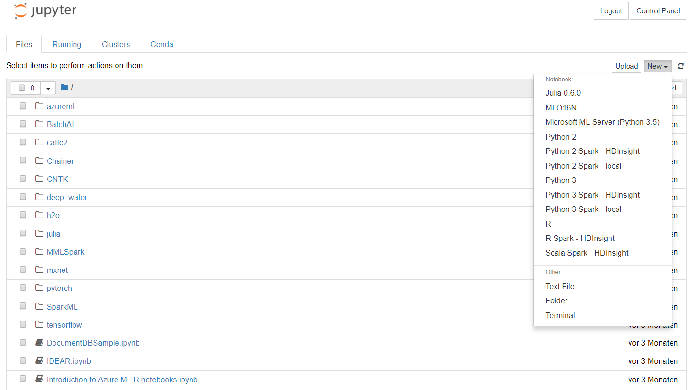

---
output:
  html_document:
    theme: cerulean
    highlight: tango
    code_folding: show
    toc: yes
    toc_float: yes
  pdf_document:
    number_sections: yes
geometry: margin = 1.2in
fontsize: 10pt
always_allow_html: yes
---

```{r cache, include=FALSE}
#Caching of all chunks
knitr::opts_chunk$set(cache=TRUE)
# Ten things you can do on the Windows Data Science Virtual Machine
```


>The Windows Data Science Virtual Machine (DSVM) is a powerful data science development environment that enables you to perform various data exploration and modeling tasks. The environment comes already built and bundled with several popular data analytics tools that make it easy to get started quickly with your analysis for On-premises, Cloud or hybrid deployments. The DSVM works closely with many Azure services and is able to read and process data that is already stored on Azure, in Azure SQL Data Warehouse, Azure Data Lake, Azure Storage, or in Azure Cosmos DB. It can also leverage other analytics tools such as Azure Machine Learning and Azure Data Factory.[^1]

In this article, I will adopt the tutorial to needs and learn how to use Azure (Linux) DSVM to perform various data science tasks and interact with other Azure services. Here are some of the things you can do on the DSVM:

1. Explore data and develop models locally on the DSVM using RStudio
2.  Use a Jupyter notebook to experiment with your data on a browser using Python 2, Python 3, Microsoft R an enterprise ready version of R designed for performance
3. Deploy models built using R and Python on Azure Machine Learning so client applications can access your models using a simple web service interface
4. Administer your Azure resources using Azure portal or Powershell
5. Extend your storage space and share large-scale datasets / code across your whole team by creating an Azure File storage as a mountable drive on your DSVM
6. Share code with your team using GitHub and access your repository using the pre-installed Git clients - Git Bash, Git GUI.
7. Access various Azure data and analytics services like Azure blob storage, Azure Data Lake, Azure HDInsight (Hadoop), Azure Cosmos DB, Azure SQL Data Warehouse & databases
8. Build reports and dashboard using the Power BI Desktop pre-installed on the DSVM and deploy them on the cloud
9. Dynamically scale your DSVM to meet your project needs
10. Install additional tools on your virtual machine


#1. Explore data and develop models locally on the DSVM using RStudio or Python

## Using RStudio Server


Prerequiesites are the set-up of Azure services, as accroind to Blog: ....

### Find the ip-adress of the DSVM e.g. by usins CLI 2.0
```{r}
library(jsonlite)
code="az vm list-ip-addresses"
a<-fromJSON(system(code,intern = TRUE))

a<-write(system(code,intern = TRUE),"test.json")
yelp <- fromJSON(file("test.json"))


yelp_flat <- jsonlite::flatten(yelp)
str(yelp_flat)
```

```{r}
library(tibble)
yelp_tbl <- as_data_frame(yelp_flat)
yelp_tbl$virtualMachine.network.publicIpAddresses[[1]]$ipAddress
```

```{r}
library(purrr)
yelp_flat1 <- purrr::flatten(yelp_flat)
yelp_flat2 <- purrr::flatten(yelp_flat1)
yelp_flat3 <- purrr::flatten(yelp_flat2)
yelp_flat4 <- purrr::flatten(yelp_flat3)

(ip<-yelp_flat4$ipAddress)
```

Or you can have set-up a static ip-Adress
```{r,eval=FALSE}
#static ip e.g. 
#ip="23.100.82.85"
```


Generate ssh phrase including password
```{r}
#make sure that sshpass is installed on Linux
ssh <- paste0("sshpass -p .oberstdorf123 ",
  "ssh -q",
             " -o StrictHostKeyChecking=no",
             " -o UserKnownHostsFile=/dev/null",
             " insider@",
             ip)
```

### Start R server

```{r}
cmd <- paste(ssh, "sudo rstudio-server start")
(b<-system(cmd, intern=TRUE))
```

Remove folder if create already

```{r}
cmd <- paste(ssh, "sudo rm -r /home/insider/R")
cmd

b<-system(cmd, intern=TRUE)
```

Create folder

```{r}
cmd <- paste(ssh, "sudo mkdir /home/insider/R")
cmd

b<-system(cmd, intern=TRUE)
```

Mount drive

```{r}
cmd <- paste(ssh, "sudo mount /dev/sdd /home/insider/R")
cmd

b<-system(cmd, intern=TRUE)
```


```{r}
browseURL(paste0("http://",ip,":8787"))
```


#2.  Use a Jupyter notebook to experiment

Simply open browser with port 8000 to open Juypter Hub. 
```{r}
browseURL(paste0("https://",ip,":8000"))
```

Enter your ID and password and will see ...




... to be continued

[^1]: Addopted from https://docs.microsoft.com/en-us/azure/machine-learning/data-science-virtual-machine/vm-do-ten-things
