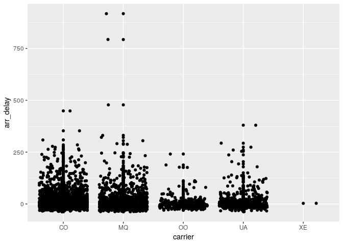

The reticulate package provides a comprehensive set of tools for interoperability between Python and R.

<!--more-->


d
>The original blog entry is here https://dannyjra.github.io/09_Reticulate/09_Reticulate3_BLOG.html and the code can be found in this repository folder https://github.com/DannyJRa/DannyJRa.github.io/tree/master//09_Reticulate/09_Reticulate3_BLOG.html


```r
#testfsfs
library(reticulate)

### Then Matplotlib works
matplotlib <- import("matplotlib")
matplotlib$use("Agg", force = TRUE)
########################################


#Test
os <- import("os")
os$getcwd()
```

```
## [1] "/home/danny/OneDrive/DataScience/11_GitHub_DannyJRa.github.io/09_Reticulate"
```

```r
os$getcwd()
```

```
## [1] "/home/danny/OneDrive/DataScience/11_GitHub_DannyJRa.github.io/09_Reticulate"
```


```
## [Text(0, 0.5, 'voltage (mV)'), Text(0.5, 0, 'time (s)'), Text(0.5, 1.0, 'About as simple as it gets, folks')]
```


#Sourcing Python scripts

You can source any Python script just as you would source an R script using the source_python() function. For example, if you had the following Python script flights.py:

import pandas
def read_flights(file):
  flights = pandas.read_csv(file)
  flights = flights[flights['dest'] == "ORD"]
  flights = flights[['carrier', 'dep_delay', 'arr_delay']]
  flights = flights.dropna()
  return flights
Then you can source the script and call the read_flights() function as follows:


```r
library(reticulate)
source_python("flights.py")
flights <- read_flights("flights.csv")

library(ggplot2)
ggplot(flights, aes(carrier, arr_delay)) + geom_point() + geom_jitter()
```

<!-- -->

#R Markdown Python Engine


## Python Version

By default, reticulate uses the version of Python found on your PATH (i.e. Sys.which("python")). If you want to use an alternate version you should add one of the use_python() family of functions to your R Markdown setup chunk, for example:

See the article on Python Version Configuration for additional details on configuring Python versions (including the use of conda or virtualenv environments).


```r
python<-Sys.which("python")
```

##Python Chunks

Python code chunks work exactly like R code chunks: Python code is executed and any print or graphical (matplotlib) output is included within the document.

Python chunks all execute within a single Python session so have access to all objects created in previous chunks. Chunk options like echo, include, etc. all work as expected.

Here’s an R Markdown document that demonstrates this:


```python

import os

import numpy as np
import matplotlib.pyplot as plt

X = np.linspace(-np.pi, np.pi, 256, endpoint=True)
C, S = np.cos(X), np.sin(X)

plt.plot(X, C)
plt.plot(X, S)

plt.show()
```


Requirement RStudio >v1.2

## Calling Python from R
All objects created within Python chunks are available to R using the py object exported by the reticulate package. For example, the following code demonstrates reading and filtering a CSV file using Pandas then plotting the resulting data frame using ggplot2:

#DJR https://rstudio.github.io/reticulate/articles/r_markdown.html

See the Calling Python from R article for additional details on how to interact with Python types from within R

## Calling R from Python

You can analagously access R objects within Python chunks via the r object. For example:


```r
library(tidyverse)
```

```
## ── Attaching packages ────────────────────────────────────────────────────────── tidyverse 1.2.1 ──
```

```
## ✔ tibble  2.1.1       ✔ purrr   0.3.2  
## ✔ tidyr   0.8.3       ✔ dplyr   0.8.0.1
## ✔ readr   1.3.1       ✔ stringr 1.4.0  
## ✔ tibble  2.1.1       ✔ forcats 0.4.0
```

```
## ── Conflicts ───────────────────────────────────────────────────────────── tidyverse_conflicts() ──
## ✖ dplyr::filter() masks stats::filter()
## ✖ dplyr::lag()    masks stats::lag()
```

```r
data<-c(1,2,3)
```


```r
library(tidyverse)
flights <- read_csv("flights.csv") %>% 
  filter(dest=="ORD") %>% 
  select(carrier, dep_delay,arr_delay) %>% 
  na.omit()
```

```
## Parsed with column specification:
## cols(
##   date = col_datetime(format = ""),
##   hour = col_double(),
##   minute = col_double(),
##   dep = col_double(),
##   arr = col_double(),
##   dep_delay = col_double(),
##   arr_delay = col_double(),
##   carrier = col_character(),
##   flight = col_double(),
##   dest = col_character(),
##   plane = col_character(),
##   cancelled = col_double(),
##   time = col_double(),
##   dist = col_double()
## )
```


```python
print(r.flights.head())
```

```
##   carrier  dep_delay  arr_delay
## 0      CO       77.0       64.0
## 1      CO        5.0        3.0
## 2      CO       -6.0      -16.0
## 3      CO        1.0       -1.0
## 4      CO        3.0       -8.0
```

