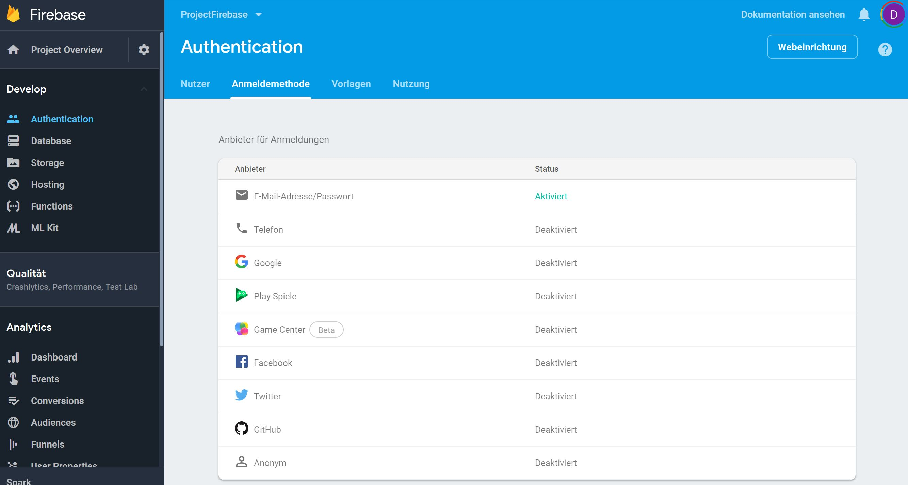

---
output:
  html_document:

---

# Adding Firebase Authentication to Shiny

## Firebase and Shiny

Firebase is a mobile and web application development platform owned by Google. Firebase provides front-end solutions for authentication, database storage, object storage, messaging, and more. Firebase drastically reduces the time needed to develop certain types of highly scalable and secure applications.

As heavy R users, Shiny is our favorite web development tool. Shiny allows us to build apps to quickly communicate our R analyses. Shiny’s elegant reactive model makes it simple to construct complex interactive data flows.

Naturally we are interested in how Firebase can super charge our Shiny applications. There are many ways the two tools can be used together, but, to us, the most obvious was to add Firebase authentication to a Shiny app. Here we do exactly that:

## Benefits over building a custom solution in R

Firebase authentication comes with security best practices out of the box. You never send passwords to your Shiny server; they are sent directly from the front-end to Firebase. No need to worry about proper ways to encrypt and store passwords.

Firebase authentication has built in solutions for common authentication needs (e.g. email verification, two-factor authentication, password reset, provider sign in through Google, Facebook, Twitter, etc.)

Many common authentication errors are checked automatically, and the proper error message is returned. e.g. if the user enters an email address without an “@” symbol, Firebase will respond with error code “auth/invalid-email” and an error message of “The email address is badly formatted.”

When you sign into your Firebase project on https://firebase.google.com, there is a nice UI for managing users. You can easily view registered users and click to disable or delete users. Additionally you can use Firebase Admin to programmatically manage users.

Firebase authenticaion naturally integrates very nicely with the other Firebase services, and Firebase (as a Google product) can be easily integrated with all of Google Cloud Platform.

## Example using Firebase Authentication with Shiny[^1]

In this Shiny app we use the default Bootstrap css provided with Shiny, and we use Firebase's email/password authentication. 

Steps to Run this App Locally
1. download or clone this repository
2. Create a Firebase account, and in your new account create a project
3. In your new Firebase project enable the email password authentication provider. This is the screen where you enable authentiation. Go to Firebase Console (e.g.)[https://console.firebase.google.com/u/0/project/projectfirebase-bced7/authentication/providers]:

4. Click the "Web Setup" button (top right in above screenshot) and copy your project's "apiKey", "authDomain", and "projectId" into the object defined in line 3 of the file "www/sof-auth.js"
5. Run the Shiny app

[^1]: Addopted from https://www.tychobra.com/posts/2019-01-03-firebasse-auth-wtih-shiny/
